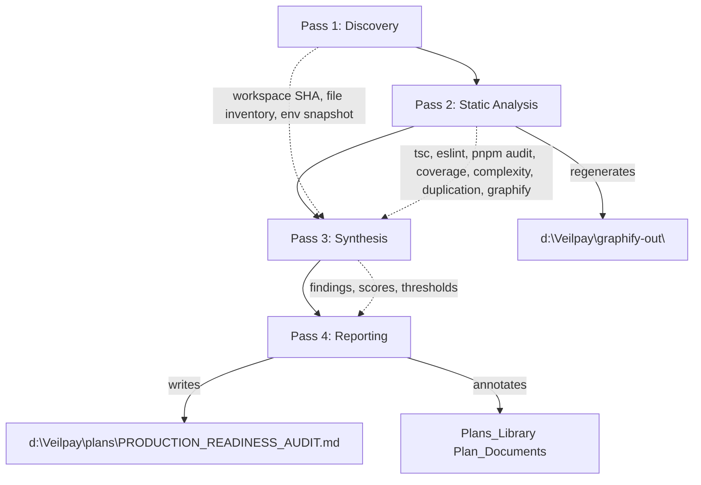

# Design Document

## Overview

This design specifies how the Auditor executes the planning-only production-readiness audit defined in `requirements.md`. The audit produces a single consolidated `Audit_Report` at `d:\Veilpay\plans\PRODUCTION_READINESS_AUDIT.md`, refreshes every existing `Plan_Document` under `d:\Veilpay\plans\`, regenerates Graphify artifacts under `d:\Veilpay\graphify-out\`, replaces the chain `Network_Icon_Set` with brand-official assets (planning only), and produces a security vulnerability list, code quality findings list, frontend polish plan, spec coherence report, and explicit production-readiness thresholds.

The audit is structured as a four-pass pipeline (Discovery, Static Analysis, Synthesis, Reporting) operating against a frozen workspace SHA. Every output is a Markdown artifact under `d:\Veilpay\plans\` or a regenerated file under `d:\Veilpay\graphify-out\`. No source files under `apps/`, `packages/`, or workspace root scripts are modified. Wallet, signing, and send code paths in `apps/consumer-app` are read-only inputs to the audit and are explicitly preserved.

The design reads acceptance criteria from `requirements.md` as the source of truth and maps each one to a concrete deliverable section, scoring rule, or check. Cross-cutting concerns (severity definitions, scoring rubric, threshold checklist) are defined once inside the `Audit_Report` and referenced from every other section to keep findings normalized.

### Design goals

- **Single source of truth.** One consolidated `Audit_Report` referenced by every other deliverable.
- **Traceability.** Every audit section traces to one or more requirement acceptance criteria and back.
- **Measurability.** Every threshold and finding field is machine-checkable so production-readiness sign-off is a checklist.
- **Non-destructive.** Modifications are confined to `d:\Veilpay\plans\`, regenerated `d:\Veilpay\graphify-out\` artifacts, and this spec's own files. Plan_Documents are preserved on disk.
- **Read-only chain access.** Verification steps that touch chains use read-only RPC and indexer queries. No signing, sending, or swapping.

### Out of scope

Implementation, refactors, dependency upgrades, source-code edits, and asset commits are out of scope and will be handled by follow-up specs once the `Audit_Report` is signed off.

## Architecture

The audit is executed by the Auditor as a four-pass pipeline against a frozen workspace state. Each pass produces inputs for the next pass and writes only to allowed output locations.



### Pass 1: Discovery

Captures the workspace state used for every downstream check. All Pass 1 outputs are recorded in the `Audit_Report` `Run Metadata` section.

- Capture workspace Git commit SHA (`git rev-parse HEAD`) and ISO 8601 generation timestamp.
- Inventory all spec directories under `d:\Veilpay\.kiro\specs\` for the `Spec_Coherence_Report`.
- Inventory every `Plan_Document` under `d:\Veilpay\plans\` for the refresh-and-score table.
- Inventory every chain network icon asset and renderer in `apps/consumer-app` for the `Network_Icon_Set` overhaul plan.
- Inventory every `tmp_*.js`, `autofix.js`, and `audit.js` file at the workspace root for triage.
- Inventory webhook routes, merchant routes, invoice routes, and admin routes in `apps/backend/src/`.

### Pass 2: Static Analysis

Runs read-only tools and captures their raw output as evidence files referenced from the `Audit_Report`. Tooling is adapted for Windows `cmd` shell.

- `graphify .` (or `graphify --update` if cache is stale) regenerates `GRAPH_REPORT.md`, `graph.json`, `manifest.json`, and `wiki/index.md` when present.
- `pnpm audit --json` at the workspace root captures dependency advisories.
- `pnpm -r exec tsc --noEmit` per app/package captures type errors and surfaces strict-mode coverage.
- `pnpm -r exec eslint . --format json` captures lint errors and warnings per workspace.
- `pnpm -r exec jest --coverage --coverageReporters=json-summary` captures coverage where Jest is configured (`apps/backend`, `apps/consumer-app`).
- A complexity probe (`pnpm dlx ts-complexity` or equivalent walking the AST) ranks the top ten cyclomatic complexity hotspots.
- A duplication probe (`pnpm dlx jscpd --ignore "**/node_modules/**" --reporters json`) identifies cross-app duplicate clusters.
- A secret-scan probe (regex sweep for `BEGIN PRIVATE KEY`, `mnemonic`, `JWT_SECRET=`, AWS-style keys, hex strings of 64 chars in committed files) captures Critical-severity matches.
- An RPC-exposure probe greps client bundles in `apps/consumer-app` and `apps/frontend` for `RPC_URL`, `INFURA`, `ALCHEMY` literals reaching client code.

Static analysis output is captured per command with: command string, exit code, run timestamp, and a path to the raw stdout/stderr file (under `d:\Veilpay\plans\.audit-evidence\`, which is treated as part of the Audit_Report deliverable).

### Pass 3: Synthesis

Transforms raw analysis output into normalized findings, scores, and recommendations.

- Each entry in raw `pnpm audit` output above the High threshold becomes a `Vulnerability_Finding`.
- Each backend route without webhook signature/timestamp validation, schema validation, or auth boundary becomes a `Vulnerability_Finding`.
- Each plaintext secret match becomes a `Vulnerability_Finding` with severity `Critical`.
- Each TypeScript file outside `strict: true` coverage contributes to the per-app strict percentage.
- Each ESLint error or warning is aggregated per app and per package.
- Each complexity hotspot becomes a `Complexity_Hotspot` entry.
- Each duplicate cluster becomes a `Duplicate_Cluster` entry.
- Each `Plan_Document` is scored across the five rubric dimensions (security, code quality, UX polish, performance, production-readiness) and gets a disposition of `updated` or `superseded`.
- Each spec under `.kiro/specs/` is compared against current implementation to produce the `Spec_Coherence_Report`.

### Pass 4: Reporting

Writes the `Audit_Report`, annotates each `Plan_Document` (Superseded_Marker prepend or Audit Refresh append), and emits the per-section sub-reports.

- The `Audit_Report` is the single consolidated artifact; all other deliverables are sections inside it.
- The `Plan_Documents` are annotated in place, never deleted.
- The Production_Readiness_Thresholds checklist is computed last because it consumes outputs of every prior section.

### Tooling adapted for Windows cmd

All commands documented in the `Audit_Report` use `cmd`-compatible syntax. No backticks, no POSIX shell expansion.

| Purpose | Command |
| --- | --- |
| Workspace Git SHA | `git rev-parse HEAD` |
| Graphify refresh | `graphify .` (fallback `graphify --update`) |
| Dependency audit | `pnpm audit --json > .audit-evidence\pnpm-audit.json` |
| Per-workspace tsc | `pnpm --filter <pkg> exec tsc --noEmit` |
| Per-workspace eslint | `pnpm --filter <pkg> exec eslint . --format json` |
| Per-workspace coverage | `pnpm --filter <pkg> exec jest --coverage --coverageReporters=json-summary --coverageReporters=text-summary` |
| Strict-mode probe | Read each `tsconfig.json`, follow `extends`, resolve effective `strict` value per file |
| Complexity probe | `pnpm dlx ts-complexity-report --json` per app |
| Duplication probe | `pnpm dlx jscpd apps packages --reporters json --output .audit-evidence` |
| Secret scan | `pnpm dlx gitleaks detect --no-git --report-path .audit-evidence\gitleaks.json` |

Failures of any tool are captured per Requirement 3.6 (and analogous handling for non-Graphify tools): record the failing command, exit code, and last 50 lines of output.

## Components and Interfaces

The `Audit_Report` is composed of the following sections, in this order. Section ordering is fixed so that downstream checklists and threshold rows can resolve references deterministically.

### Audit_Report section ordering

1. Title and Run Metadata (timestamp, Git SHA, Graphify run timestamp)
2. Executive Summary (<= 500 words)
3. Scoring Rubric
4. Severity Definitions
5. Production_Readiness_Thresholds
6. Per-Surface Audit Sections
   - Backend_Service
   - Consumer_App
   - Frontend_App
   - Indexer_Service
   - Shared `packages/*`
7. Cross-Cutting Audit Sections
   - On-chain integration
   - Webhooks
   - Auth boundaries
   - Error handling
   - Observability
   - Test coverage
   - Build and deploy
8. Security_Findings_List
9. Code_Quality_Findings_List
10. Spec_Coherence_Report
11. Frontend_Polish_Plan
12. Network_Icon_Set Replacement Plan
13. Plans_Library Refresh Table
14. Graphify Refresh Summary (with top three architectural observations)
15. Pass/Fail Verdict
16. Appendices (raw evidence pointers)

The executive summary in section 2 is capped at 500 words per Requirement 1.5.

### Run Metadata block

Every audit run starts with a fixed-shape metadata block:

```markdown
## Run Metadata

- Generated: 2025-01-15T14:32:11Z
- Workspace SHA: <git rev-parse HEAD>
- Graphify Run: 2025-01-15T14:30:08Z
- Auditor: <name or "automated">
- Plans_Library Snapshot: <list of plan filenames>
```

### Scoring_Rubric section

The Scoring_Rubric is a single section in the `Audit_Report` defining bands for each rubric dimension. The rubric defines five 0-100 dimensions: security, code quality, UX polish, performance, production-readiness. Each dimension has the same band structure, with a fixed pass threshold.

| Band | Range | Meaning |
| --- | --- | --- |
| Excellent | 90-100 | Production ready in this dimension; no follow-up needed |
| Strong | 75-89 | Production ready with minor follow-ups |
| Adequate | 60-74 | Acceptable for staging; gaps must be tracked |
| Weak | 40-59 | Not production ready; actionable plan required |
| Critical | 0-39 | Blocking; do-not-ship |

Pass threshold is 85. A `Plan_Score` passes only when every dimension is >= 85, matching Requirement 9.5. When any dimension is below 85, the section listing the score MUST list the specific gaps that drove the score for that dimension (Requirement 2.7).

### Severity_Definitions section

A single section in the `Audit_Report` defines the four `Severity_Level` values:

- **Critical**: Plaintext secret exposure; private-key or mnemonic mishandling; signing flow that can be triggered by an unauthenticated request; production data deletion path with no auth.
- **High**: Missing webhook signature or timestamp window; missing auth boundary on merchant/invoice/admin route; client-bundle exposure of RPC credentials; pnpm audit advisory marked High or Critical.
- **Medium**: Missing input schema validation; permissive CORS; missing rate limiting; weak JWT lifetime or refresh policy.
- **Low**: Logging hygiene gaps that do not include secret values; deprecated API usage; non-blocking dependency advisories.

### Plans_Library Refresh component

This component refreshes every `Plan_Document` enumerated in Requirement 2.2.

**Inputs:** the seven `Plan_Document` paths listed in Requirement 2.2.

**Behavior:**

1. Read each `Plan_Document`.
2. Score it across the five rubric dimensions to produce a `Plan_Score`.
3. Decide disposition:
   - `updated` if the document still describes work that is current or in-flight.
   - `superseded` if the document's scope is fully replaced by the `Audit_Report` or by `.kiro/specs/veilpay-privacy-stack`.
4. Annotate the file in place:
   - `superseded`: prepend a `Superseded_Marker` block.
   - `updated`: append an `## Audit Refresh` section.
5. Record the entry in the `Audit_Report` Plans_Library Refresh Table.

**Superseded_Marker format (prepended to the file):**

```markdown
> [!WARNING]
> **SUPERSEDED 2025-01-15**
> This plan has been superseded by [PRODUCTION_READINESS_AUDIT.md](./PRODUCTION_READINESS_AUDIT.md).
> Refer to that document for the current production-readiness assessment.
> Original content preserved below for historical reference.

---
```

**Audit Refresh section format (appended to the file):**

```markdown
## Audit Refresh

- **Refreshed:** 2025-01-15
- **Auditor:** <name or "automated">
- **Plan_Score:** Security 87 | Code Quality 78 | UX Polish 91 | Performance 82 | Production-Readiness 80
- **Disposition:** updated
- **Summary of Changes:**
  - <bullet describing what changed since the original document was written>
  - <bullet linking new findings to sections of PRODUCTION_READINESS_AUDIT.md>
- **Cross-Reference:** [PRODUCTION_READINESS_AUDIT.md#<anchor>](./PRODUCTION_READINESS_AUDIT.md#<anchor>)
```

**Plans_Library Refresh Table (in the Audit_Report):**

| Plan_Document | Disposition | Security | Code Quality | UX Polish | Performance | Production-Readiness | Notes |
| --- | --- | --- | --- | --- | --- | --- | --- |
| `AUDIT_REPORT.md` | superseded | ... | ... | ... | ... | ... | superseded by this audit |
| `COMPREHENSIVE_AUDIT_REPORT.md` | superseded | ... | ... | ... | ... | ... | superseded by this audit |
| `consumer-app-production-audit.md` | updated | ... | ... | ... | ... | ... | merged into Consumer_App section |
| `full_stack_audit.md` | updated | ... | ... | ... | ... | ... | refreshed scores |
| `implementation_plan.md` | updated | ... | ... | ... | ... | ... | reconciled with veilpay-privacy-stack |
| `MERCHANT_DASHBOARD_SPEC.md` | updated | ... | ... | ... | ... | ... | gap list appended |
| `ROADMAP.md` | updated | ... | ... | ... | ... | ... | dates resequenced |

### Graphify Refresh component

**Behavior:**

1. Run `graphify .` from the workspace root. If the cache is stale, fall back to `graphify --update`.
2. Verify regeneration of `d:\Veilpay\graphify-out\GRAPH_REPORT.md`, `d:\Veilpay\graphify-out\graph.json`, and `d:\Veilpay\graphify-out\manifest.json`.
3. If `d:\Veilpay\graphify-out\wiki\index.md` exists, verify its mtime is newer than the run start.
4. Record the run timestamp in the Run Metadata block.
5. In the `Audit_Report` Graphify Refresh Summary section, link to the regenerated `GRAPH_REPORT.md` and quote its top three architectural observations verbatim.
6. **Failure capture:** if the `graphify` invocation exits non-zero, record in the section:
   - The exact failing command line.
   - The integer exit code.
   - The last 50 lines of combined stdout/stderr, fenced as a code block.
   - On a successful run, the failure capture block is omitted.

### Network_Icon overhaul component

This component produces a planning-only replacement plan; it does not commit asset files (Requirement 10.1, 10.3).

**Inventory step:**

1. Walk `apps/consumer-app/assets/` and `apps/consumer-app/src/` for raster and vector assets matching `network*`, `chain*`, or any of the chain slugs (`ethereum`, `polygon`, `base`, `arbitrum`, `optimism`, `solana`, `bnb`, `avalanche`).
2. Identify the `Network_Icon_Component` files that import or reference each asset.
3. Record `Network_Icon` entries (see Data Models below).

**Brand asset sourcing step:** for each network in the `Network_Icon_Set`, locate the canonical brand kit URL and record:

- Network name and chain slug.
- Brand kit URL (foundation site or official media kit).
- Licensing terms and a one-sentence compatibility note for VeilPay's intended use.
- Recommended SVG asset filename (`network-<chain-slug>.svg`).

**Replacement plan step:**

- Specify SVG as primary, PNG @1x/@2x/@3x as fallback (Requirement 4.5).
- Specify the target directory inside `apps/consumer-app` for the replacement assets.
- For each `Network_Icon_Component` consumer, document the import surface that the replacement must preserve so follow-up implementation specs can land assets without breaking renderers.
- For any network that lacks an officially licensed asset, list it as a known gap with a recommended fallback (e.g., monogram) and a follow-up action.

### Frontend_Polish_Plan component

The plan is authored as an `Audit_Report` section and cites `.agents/anthropics-skills/skills/frontend-design/SKILL.md` (Requirement 5.2).

**Subsections:**

- **Authoring reference.** Quote the citation and one-line summary of the skill.
- **Typography scale.** Named tokens (e.g., `display-xl`, `display-lg`, `heading-md`, `body-md`, `body-sm`, `caption`) with pixel sizes, line heights, and weights. Display font and body font are paired per the skill's "distinctive display + refined body" guidance.
- **Spacing system.** Named tokens (`space-0`, `space-1`, ..., `space-12`) mapped to pixel values on a base-4 scale.
- **Motion and transitions.** Per-interaction duration (ms) and easing curve for: screen transitions, button presses, modal entry, modal exit, list item enter/exit, success/failure haptic-paired animations.
- **State patterns.** Empty / loading skeleton / error patterns for at minimum:
  - Wallet (balance, token list, transaction history)
  - Invoice (creation form, detail, status)
  - Transaction history (list, detail, retry)
  - Merchant dashboard (overview, invoices, settings)
- **Accessibility targets.** WCAG 2.1 Level AA color contrast (>= 4.5:1 normal text, >= 3:1 large text), touch target >= 44pt, plus a list of screens currently verified against this target and a list of screens not yet verified.
- **Dark mode parity.** Definition of parity (every screen present in light mode is reachable and legible in dark mode), and an explicit list of any screens lacking parity at audit time.
- **Haptics.** Patterns for payment confirmation, payment failure, copy-to-clipboard, and pull-to-refresh.

### Security audit component

Methodology covers every acceptance criterion in Requirement 6.

| Check | Tool/Method | Severity floor |
| --- | --- | --- |
| Plaintext secrets sweep | `gitleaks detect --no-git` plus regex sweep for `BEGIN PRIVATE KEY`, `mnemonic`, JWT secrets, AWS keys, 64-char hex literals | Critical |
| Backend log inspection | grep `apps/backend/src/**` for `console.log`, `logger.*`, `pino.*`, `winston.*` and check arguments for token-shaped values, `Authorization`, request bodies | Up to Critical |
| Webhook signature/timestamp | Walk webhook routes, confirm signature header verification and a timestamp window (default 5 minutes) | High floor |
| Auth boundaries | Walk merchant/invoice/admin routes, confirm middleware presence and scope check | Up to Critical |
| `pnpm audit` advisories | `pnpm audit --json`, filter severity High/Critical | High floor |
| Input validation | Walk routes, confirm a Zod/Joi/Yup schema or equivalent before handler runs | Medium floor |
| Rate limiting + CORS | Inspect server bootstrap for rate-limit middleware and CORS config; record allowed origins | Medium floor |
| JWT/session handling | Inspect signing algorithm (must be asymmetric or HS256 with rotation), token TTL, refresh strategy | Up to High |
| RPC URL exposure | grep client bundles for `RPC_URL`, `INFURA`, `ALCHEMY`, `QUICKNODE` literals, confirm proxying | High floor |
| Mnemonic/key handling | Walk `apps/consumer-app/src/utils/secureSigner.ts` and related signers; confirm no log/network/persist outside secure store | Critical |

**Constraint:** Wallet, signing, and send code paths are read-only inputs. The audit reads them, never edits them (Requirement 6.14).

### Code quality audit component

| Check | Method | Output |
| --- | --- | --- |
| TypeScript strict coverage | Resolve effective `strict` per file via tsconfig walk; compute % per app/package | Per-target percentage |
| ESLint cleanliness | `eslint . --format json` per workspace | Errors and warnings counts per app/package |
| Root script triage | Enumerate `tmp_*.js`, `autofix.js`, `audit.js` at workspace root | Per-file `keep`/`archive`/`remove` with justification |
| Coverage measurement | Jest `--coverage` per app/package; read `coverage-summary.json` | Statements/branches/functions/lines per target |
| Complexity hotspots | AST cyclomatic complexity per function | Top 10 hotspots (file, function, score) |
| Cross-app duplication | `jscpd` over `apps/` and `packages/` | Duplicate clusters (paths, dedup recommendation) |

### Spec_Coherence_Report component

For each spec directory under `d:\Veilpay\.kiro\specs\`:

1. Summarize the spec scope (one paragraph) from `requirements.md`.
2. Cross-check each requirement against current implementation. Map satisfied requirements to the source files that satisfy them; map unsatisfied requirements to "not yet present".
3. For `veilpay-privacy-stack` specifically, also cross-check `design.md` and `tasks.md`.
4. Surface implementation behaviors that no spec describes; recommend either spec'ing the behavior or removing it.

The component never modifies files under `.kiro/specs/` (Requirement 8.6).

### Production_Readiness_Thresholds component

The thresholds checklist is written as a Markdown table:

| # | Threshold | Current Value | Pass |
| --- | --- | --- | --- |
| 1 | Critical security findings = 0 | <count> | pass/fail |
| 2 | High security findings = 0 | <count> | pass/fail |
| 3 | Critical-path test coverage >= <%> | <%> | pass/fail |
| 4 | Every Plan_Document Plan_Score >= 85 in every rubric dimension | <min across dims/plans> | pass/fail |
| 5 | Graph_Report regenerated within 24h of sign-off | <delta hours> | pass/fail |
| 6 | Network_Icon_Set 100% replaced with brand-official assets (excluding documented gaps) | <%> | pass/fail |
| 7 | ESLint errors = 0 across every app and package | <count> | pass/fail |
| 8 | `pnpm audit` High and Critical advisories = 0 | <count> | pass/fail |

The "critical paths" referenced in row 3 are defined inline (Requirement 9.4) as: invoice creation, invoice settlement, webhook delivery, webhook signature verification, wallet send flow, balance fetch, transaction status polling, and auth/JWT issuance/refresh.

The overall `Pass/Fail Verdict` (Requirement 9.10) is `pass` only when every threshold row is `pass`.

## Data Models

All models below are content schemas for sections of the `Audit_Report`. They are not persisted in a database; they describe the structure of Markdown content the Auditor must emit.

### Vulnerability_Finding

```yaml
id: VULN-<seq>          # zero-padded sequential within the audit, e.g., VULN-0001
title: string           # short, descriptive
severity: Critical | High | Medium | Low
location:
  path: string          # repository-relative file path
  lines: string | null  # e.g., "L42-L58"; null when finding is file-scope
description: string     # what is wrong and why it matters
remediation: string     # concrete fix
remediation_owner: string  # team or role; e.g., "backend", "consumer-app", "platform"
references: list[string]  # URLs to advisories or skill references
```

Markdown rendering:

```markdown
#### VULN-0001 — Webhook handler accepts unsigned payloads

- **Severity:** High
- **Location:** `apps/backend/src/routes/webhooks/billing.ts` (L24-L52)
- **Description:** The route registers a handler before signature middleware runs, allowing an unauthenticated client to fire state changes.
- **Remediation:** Move the handler registration after `verifyWebhookSignature` middleware and add a 5-minute timestamp window.
- **Owner:** backend
- **References:** [api-security-best-practices](../../packages/antigravity-utils/skills/api-security-best-practices/SKILL.md)
```

### Plan_Score

```yaml
plan_path: string                    # e.g., plans/ROADMAP.md
disposition: updated | superseded
scores:
  security: integer 0..100
  code_quality: integer 0..100
  ux_polish: integer 0..100
  performance: integer 0..100
  production_readiness: integer 0..100
gaps: list[GapNote]                  # populated for any dimension < 85
GapNote:
  dimension: security | code_quality | ux_polish | performance | production_readiness
  note: string                       # what specifically dragged the score below pass
```

When any dimension score is below the rubric pass threshold (85), the corresponding `gaps` list MUST contain at least one entry for that dimension (Requirement 2.7).

### Network_Icon entry

```yaml
chain_slug: string            # lowercase canonical id, e.g., "ethereum"
display_name: string          # e.g., "Ethereum"
current_assets: list[string]  # repository-relative paths
renderer_paths: list[string]  # files that import or render the asset
brand_kit_url: string | null
license_terms: string | null
license_compatible: boolean | unknown
target_filename: string       # network-<chain-slug>.svg
target_directory: string      # e.g., apps/consumer-app/assets/networks/
fallback_action: string | null  # populated when license_compatible is false or asset missing
```

Required entries (Requirement 4.2): `ethereum`, `polygon`, `base`, `arbitrum`, `optimism`, `solana`, `bnb`, `avalanche`.

### Complexity_Hotspot

```yaml
rank: integer 1..10
path: string         # repository-relative
function: string     # function name; "default export" if anonymous
score: integer       # cyclomatic complexity
```

Exactly ten entries are emitted (Requirement 7.6).

### Duplicate_Cluster

```yaml
cluster_id: string
locations: list[string]   # at least two paths, drawn from at least two of: apps/backend, apps/consumer-app, apps/frontend, apps/indexer
shared_lines: integer
recommendation: string    # "extract to packages/shared/<module>" or similar
```

Each cluster's `locations` MUST include paths from at least two of the four apps (Requirement 7.7).

### Production_Readiness_Threshold row

```yaml
id: integer            # 1..N, fixed ordering matches the table above
label: string
target: string         # human-readable target, e.g., "= 0", ">= 80%"
current_value: string  # measured value at audit time
pass: boolean
explanation: string    # short, one-line, references underlying section
```

The overall verdict (Requirement 9.10) is the logical AND of every row's `pass` field.

### Severity_Definition row

```yaml
level: Critical | High | Medium | Low
definition: string
example_findings: list[string]  # short, audit-document-only references
```

Exactly four entries (Requirement 6.2).

### Audit_Report top-level structure

```yaml
metadata:
  generated_at: ISO 8601 string
  workspace_sha: string
  graphify_run_at: ISO 8601 string
  auditor: string
executive_summary: string                   # <= 500 words (Requirement 1.5)
scoring_rubric: ScoringRubric
severity_definitions: list[Severity_Definition]
production_readiness_thresholds: list[Production_Readiness_Threshold]
per_surface_sections:                       # Requirement 1.2
  - backend_service: AuditSection
  - consumer_app: AuditSection
  - frontend_app: AuditSection
  - indexer_service: AuditSection
  - shared_packages: AuditSection
cross_cutting_sections:                     # Requirement 1.3
  - on_chain_integration: AuditSection
  - webhooks: AuditSection
  - auth_boundaries: AuditSection
  - error_handling: AuditSection
  - observability: AuditSection
  - test_coverage: AuditSection
  - build_and_deploy: AuditSection
security_findings_list: list[Vulnerability_Finding]
code_quality_findings_list:
  ts_strict_coverage: map[target -> percent]
  eslint_counts: map[target -> { errors, warnings }]
  root_script_triage: list[ScriptTriage]
  test_coverage: map[target -> CoverageSummary]
  complexity_hotspots: list[Complexity_Hotspot]   # exactly 10 (Requirement 7.6)
  duplicate_clusters: list[Duplicate_Cluster]
spec_coherence_report:
  spec_subsections: list[SpecSubsection]   # one per spec dir (Requirement 8.2)
  privacy_stack_subsection: SpecSubsection # explicit subsection (Requirement 8.3)
  unspecced_behaviors: list[UnspeccedBehavior]
frontend_polish_plan: FrontendPolishPlan
network_icon_replacement_plan: list[Network_Icon]
plans_library_refresh: list[Plan_Score]
graphify_refresh_summary:
  run_at: ISO 8601 string
  graph_report_link: string
  top_observations: list[string]            # exactly 3 (Requirement 3.4)
  failure_capture: FailureCapture | null    # null on success (Requirement 3.6)
verdict: pass | fail                        # AND of all thresholds (Requirement 9.10)
```


## Correctness Properties

*A property is a characteristic or behavior that should hold true across all valid executions of a system — essentially, a formal statement about what the system should do. Properties serve as the bridge between human-readable specifications and machine-verifiable correctness guarantees.*

The deliverable of this spec is a structured documentation artifact (the `Audit_Report`) plus annotations on existing files (`Plan_Documents`) plus regenerated tooling output (Graphify). Property-based testing applies to the *shape* of these artifacts: every required section is present, every finding has a complete record, every score is in range, every threshold is measurable, every preserved file remains byte-equal, and the verdict is the conjunction of every threshold row.

The following 15 properties are derived from the prework analysis. Many acceptance criteria are aggregated into single comprehensive properties to eliminate redundancy (see prework Property Reflection).

### Property 1: Audit_Report contains every required section and link

*For any* successful audit run, the rendered `Audit_Report` SHALL contain a heading or anchor for every required section: the five per-surface sections (`Backend_Service`, `Consumer_App`, `Frontend_App`, `Indexer_Service`, shared `packages/*`); the seven cross-cutting sections (on-chain integration, webhooks, auth boundaries, error handling, observability, test coverage, build and deploy); the `Scoring_Rubric`, `Severity_Definitions`, `Production_Readiness_Thresholds`, `Security_Findings_List`, `Code_Quality_Findings_List`, `Spec_Coherence_Report`, `Frontend_Polish_Plan`, `Network_Icon_Set` Replacement Plan, `Plans_Library` Refresh Table, and `Graphify` Refresh Summary; and resolvable intra-document links to the five lists referenced by Requirement 1.7.

**Validates: Requirements 1.2, 1.3, 1.7, 2.6, 3.4, 5.1, 6.1, 7.1, 8.1, 9.1**

### Property 2: Run Metadata parses to valid ISO 8601 and the executive summary fits the word budget

*For any* successful audit run, the Run Metadata block SHALL contain a `Generated` timestamp parseable as ISO 8601, a non-empty `Workspace SHA`, and a `Graphify Run` timestamp parseable as ISO 8601; and the executive summary section SHALL contain at most 500 words.

**Validates: Requirements 1.4, 1.5, 3.5**

### Property 3: Every Vulnerability_Finding is well-formed

*For any* `Vulnerability_Finding` recorded in the `Security_Findings_List`, the entry SHALL contain non-empty values for `id`, `title`, `severity` ∈ {`Critical`, `High`, `Medium`, `Low`}, `location.path`, `description`, `remediation`, and `remediation_owner`; and `location.lines` SHALL be present if and only if the finding pinpoints specific lines.

**Validates: Requirements 1.6, 6.3**

### Property 4: Evidence-to-finding traceability

*For any* evidence entry produced by Pass 2 static analysis (plaintext-secret hit, backend log secret hit, webhook route lacking signature or timestamp, merchant/invoice/admin route lacking auth, `pnpm audit` advisory at severity High or Critical, API route lacking schema validation, missing rate limit, permissive CORS, JWT policy deviation, RPC URL exposure in client bundle, mnemonic/private-key code path deviation), the `Security_Findings_List` SHALL contain a `Vulnerability_Finding` whose `location` references the evidence and whose `severity` is at least the floor defined for that evidence source in the Security audit component.

**Validates: Requirements 6.4, 6.5, 6.6, 6.7, 6.8, 6.9, 6.10, 6.11, 6.12, 6.13**

### Property 5: Plan_Score completeness and gap-traceability

*For any* `Plan_Document` listed in the canonical set defined by Requirement 2.2, the `Plans_Library` Refresh Table SHALL contain exactly one row whose disposition is `updated` or `superseded` and whose five rubric dimension scores are integers in the range 0..100; and for every dimension whose score is below the rubric pass threshold (85), the corresponding `gaps` list SHALL contain at least one entry tagged for that dimension.

**Validates: Requirements 2.2, 2.6, 2.7**

### Property 6: Plan_Document annotation invariant

*For any* `Plan_Document` with disposition `superseded`, the file content SHALL begin with the `Superseded_Marker` block, which contains a link to `PRODUCTION_READINESS_AUDIT.md` and an ISO 8601 supersession date; and *for any* `Plan_Document` with disposition `updated`, the file content SHALL end with an `## Audit Refresh` section containing the refreshed `Plan_Score`, an ISO 8601 refresh date, and a non-empty summary list.

**Validates: Requirements 2.4, 2.5**

### Property 7: Modification-set invariant

*For any* file in the workspace whose path is not under `d:\Veilpay\plans\`, not under `d:\Veilpay\graphify-out\`, and not inside `d:\Veilpay\.kiro\specs\production-readiness-audit\`, the file's bytes SHALL be identical before and after the audit run; and `Plan_Documents` annotated by the audit SHALL preserve their original content as a contiguous substring of the post-audit file.

**Validates: Requirements 2.3, 6.14, 8.6, 10.1, 10.2, 10.3, 10.4, 10.5**

### Property 8: Network_Icon entries are well-formed and licensed-or-gapped

*For any* network in the canonical set {`ethereum`, `polygon`, `base`, `arbitrum`, `optimism`, `solana`, `bnb`, `avalanche`}, the `Network_Icon_Set` Replacement Plan SHALL contain exactly one `Network_Icon` entry whose `target_filename` matches the regex `^network-[a-z0-9-]+\.svg$`, whose `target_directory` starts with `apps/consumer-app/`, whose `renderer_paths` list is either non-empty or explicitly documents that no current renderer exists, and which satisfies the licensing rule: either `brand_kit_url` and `license_terms` are non-null and `license_compatible ∈ {true, false, unknown}`, or `fallback_action` is non-null when `license_compatible ≠ true`.

**Validates: Requirements 4.2, 4.3, 4.4, 4.6, 4.7, 4.8, 4.9**

### Property 9: Frontend_Polish_Plan token and surface coverage

*For any* successful audit run, the `Frontend_Polish_Plan` SHALL contain a typography scale where every entry has a name and a positive integer pixel size; a spacing system where every entry has a name and a non-negative integer pixel value; a motion table containing entries for at least screen transitions, button presses, modal entry, and modal exit, each with a duration in milliseconds and an easing curve; pattern entries (empty, loading, error) for each of the wallet, invoice, transaction history, and merchant dashboard surfaces; a WCAG 2.1 Level AA target with verified-screens list; a dark mode parity definition with non-parity gap list; and haptic entries for payment confirmation, payment failure, copy-to-clipboard, and pull-to-refresh.

**Validates: Requirements 5.3, 5.4, 5.5, 5.6, 5.7, 5.8, 5.9**

### Property 10: Code_Quality_Findings completeness

*For any* app or package in the workspace, the `Code_Quality_Findings_List` SHALL record a TypeScript strict-mode coverage percentage in 0..100, an ESLint error count and warning count as non-negative integers, and four test coverage percentages (statements, branches, functions, lines) in 0..100; the root-script triage SHALL contain exactly one entry per file matching `tmp_*.js`, `autofix.js`, or `audit.js` at the workspace root, each with a classification ∈ {`keep`, `archive`, `remove`} and a non-empty justification; the complexity hotspots list SHALL contain exactly ten entries each with file path, function name, and a positive integer complexity score; and every duplicate cluster SHALL list paths from at least two of `apps/backend`, `apps/consumer-app`, `apps/frontend`, `apps/indexer`.

**Validates: Requirements 7.2, 7.3, 7.4, 7.5, 7.6, 7.7**

### Property 11: Spec_Coherence subsection coverage

*For any* spec directory under `d:\Veilpay\.kiro\specs\`, the `Spec_Coherence_Report` SHALL contain exactly one subsection that summarizes the spec's scope and lists implementation gaps; the `veilpay-privacy-stack` subsection SHALL specifically compare its `requirements.md`, `design.md`, and `tasks.md` against current implementation; every unimplemented-behavior gap SHALL include a behavior description, a spec section reference, and either an affected source file path or the literal string `not yet present`; and every unspecced-behavior entry SHALL include a behavior description, a source file path, and a recommendation.

**Validates: Requirements 8.2, 8.3, 8.4, 8.5**

### Property 12: Production_Readiness_Thresholds rule completeness

*For any* successful audit run, the `Production_Readiness_Thresholds` checklist SHALL contain a row for each of: Critical security findings = 0; High security findings = 0; minimum critical-path test coverage with a defined critical-path list; every `Plan_Score` ≥ 85 in every rubric dimension; `Graph_Report` regenerated within 24 hours of sign-off (where a delta of 0 hours counts as passing); `Network_Icon_Set` 100% replaced with brand-official assets except for documented Requirement 4.9 gaps; ESLint errors = 0 across every app and package; and `pnpm audit` High and Critical advisories = 0; and every row SHALL contain non-empty values for threshold label, current value, and pass status ∈ {`pass`, `fail`}.

**Validates: Requirements 9.2, 9.3, 9.4, 9.5, 9.6, 9.7, 9.8, 9.9**

### Property 13: Verdict is the conjunction of threshold rows

*For any* `Production_Readiness_Thresholds` table emitted by the audit, the overall `Pass/Fail Verdict` SHALL be `pass` if and only if every row in the table has pass status `pass`.

**Validates: Requirements 9.10**

### Property 14: Graphify failure capture matches exit code

*For any* `Graphify_Pipeline` invocation, the `Graphify` Refresh Summary SHALL contain a failure capture block (with the failing command, integer exit code, and at most the last 50 lines of combined stdout/stderr) if and only if the invocation's exit code is non-zero.

**Validates: Requirements 3.6**

### Property 15: Scoring_Rubric bands cover 0-100 contiguously across five dimensions

*For any* `Scoring_Rubric` defined in the `Audit_Report`, the rubric SHALL define exactly five dimensions (security, code quality, UX polish, performance, production-readiness) each with bands whose ranges, when sorted, partition the integer interval 0..100 with no gaps and no overlaps; and each dimension SHALL declare an explicit pass threshold.

**Validates: Requirements 2.1**

## Error Handling

The audit pipeline distinguishes between hard failures (which abort the run) and soft failures (which are recorded as findings or evidence and the run continues).

### Hard failures (abort)

The following errors abort Pass 2 and the audit halts before Pass 3:

- Workspace `git rev-parse HEAD` fails. The workspace is not a git repository or HEAD is undefined; the run cannot record an authoritative SHA, so the audit stops and emits no `Audit_Report`.
- `pnpm-workspace.yaml` is missing or malformed; the audit cannot enumerate workspaces.
- The `apps/` or `packages/` directory is missing entirely.

When a hard failure aborts the run, the Auditor writes a one-paragraph abort note (with command, exit code, last 50 lines of output, and timestamp) to `d:\Veilpay\plans\.audit-evidence\ABORT.md` and does not modify any `Plan_Document`.

### Soft failures (recorded, run continues)

The following errors are captured in evidence and converted into either findings or `Plan_Score` deductions, then the run proceeds:

- **Graphify failure.** The Graphify Refresh Summary failure capture (Property 14) records command, exit code, last 50 lines of output. The Graphify-related Production_Readiness_Threshold row fails. The audit continues.
- **`pnpm audit` failure.** Recorded as evidence; if the failure is the lockfile being out of sync, that fact becomes a Medium-severity finding. The High/Critical advisory threshold row fails when advisory data cannot be obtained.
- **Per-workspace `tsc` or `eslint` failure.** The error is recorded against that workspace; the strict-coverage and ESLint counts for that workspace are marked `unmeasured`. The corresponding Code_Quality_Findings entry is non-numeric and the threshold rows that depend on the missing data fail.
- **Per-workspace coverage failure.** The coverage entry is marked `unmeasured`. The critical-path coverage threshold fails.
- **Duplication probe failure.** The duplicate clusters list is empty with a one-line evidence note. No threshold depends on this directly; the related findings section explicitly says "duplication scan failed".
- **Complexity probe failure.** The hotspots list is short or empty with an evidence note. Property 10 then identifies the audit as incomplete; the corresponding Code_Quality threshold fails.
- **Brand-kit URL or license sourcing failure.** The Network_Icon entry is recorded with `brand_kit_url: null`, `license_compatible: unknown`, and a `fallback_action` describing the gap, satisfying Requirement 4.9 and Property 8.

### Annotation conflicts

When annotating a `Plan_Document`:

- If the file already contains a previous `Superseded_Marker`, the Auditor updates the supersession date and audit link in place rather than prepending a duplicate marker.
- If the file already contains a previous `## Audit Refresh` section, the Auditor appends a new `## Audit Refresh — <ISO date>` section after the existing one, preserving the original.

This keeps Property 7 (modification-set invariant) intact: original content remains a contiguous substring even after multiple refresh cycles.

### Data integrity guards

- All evidence files under `d:\Veilpay\plans\.audit-evidence\` are written atomically (temp file + rename) so a partial run does not poison subsequent runs.
- The `Audit_Report` is written last, after every dependent section is computed, so an aborted run never leaves a half-written report at the canonical path.
- Wallet, signing, and send code path files (`apps/consumer-app/src/utils/secureSigner.ts`, related signers, send-flow screens) are read with read-only file handles; the audit never opens them for write. Property 7 covers this invariant for the wider workspace; this guard makes it explicit for the highest-risk paths.

## Testing Strategy

### Dual testing approach

- **Unit and integration tests** verify specific examples and one-off behaviors of the audit pipeline (e.g., that the abort note is written when `git rev-parse HEAD` fails, that the executive summary section renders).
- **Property-based tests** verify the 15 universal properties from the Correctness Properties section against generated `Audit_Report` content.

The audit deliverable is a structured Markdown artifact with a parseable schema (see Data Models). The properties are well-suited to PBT because the input space (synthetic findings, plans, networks, scores, threshold values, evidence streams) is large and varied, and the properties (well-formedness, traceability, modification invariants, conjunction of thresholds) are universal across that input space.

### PBT applicability assessment

PBT IS appropriate for this feature because:

- The `Audit_Report` is a pure rendering of structured data (Pass 3 outputs) into Markdown. The renderer is a pure function and the schema is well-defined.
- Universal properties (every finding well-formed, every threshold present, verdict is conjunction of rows, modification-set invariant) hold across all inputs.
- Property generators (synthetic findings, synthetic plans, synthetic threshold values, synthetic file trees) are inexpensive to construct and run 100+ iterations against in-memory.

PBT IS NOT used for:

- The Pass 1 inventory of the live workspace (one-time discovery; verified by example tests).
- The actual `graphify .` invocation (external tool; verified by smoke test).
- The Pass 4 file write to `d:\Veilpay\plans\PRODUCTION_READINESS_AUDIT.md` (single existence check).

### Testing tooling

- Property-based testing library: `fast-check` (TypeScript / Jest), to align with the existing Jest configuration in `apps/backend` and `apps/consumer-app`.
- Renderer is implemented as a pure function `renderAuditReport(input: AuditReportData): string` so tests can roundtrip generated inputs into rendered output and parse them back.
- Markdown parsing for assertions uses `remark` (or equivalent) so heading/anchor structure can be inspected without brittle regex.
- Modification-set invariant tests use a temporary working copy of the workspace; tests snapshot file hashes before and after a simulated audit run.

### Property test configuration

- Each property test runs at least 100 iterations.
- Each property test is tagged with a comment in the form: `// Feature: production-readiness-audit, Property <number>: <property text>` referencing the Correctness Properties section.
- Generators are built per data model: `Vulnerability_Finding`, `Plan_Score`, `Network_Icon`, `Complexity_Hotspot`, `Duplicate_Cluster`, `Production_Readiness_Threshold`, `Severity_Definition`, and `AuditReportData`.
- Edge cases covered by generators: empty findings list, single finding, max-length finding fields, severity distribution skew, every plan superseded, every plan updated, every threshold pass, every threshold fail, mixed exit-code Graphify outcomes, missing license info, sub-pass dimension scores.

### Unit and integration tests (focused)

These complement the property tests for behaviors that are not universal:

- The `Plan_Document` annotation routine writes a `Superseded_Marker` at the head when disposition is `superseded` (example test with one fixture file).
- The `Plan_Document` annotation routine writes an `## Audit Refresh` section at the tail when disposition is `updated` (example test).
- The Graphify Refresh Summary section quotes exactly the first three observations from a fixture `GRAPH_REPORT.md` (example test).
- The abort path writes `ABORT.md` under `.audit-evidence` and does not write the `Audit_Report` (integration test, simulated `git` failure).
- The Run Metadata block contains all required fields when the audit runs successfully against a fixture workspace (smoke test).
- The `Audit_Report` is the only file written to `d:\Veilpay\plans\` other than the in-place `Plan_Document` annotations (integration test).

### Verification flow per audit run

1. Pass 2 evidence files are written under `d:\Veilpay\plans\.audit-evidence\`.
2. Pass 3 produces `AuditReportData` in memory.
3. PBT runs the 15 properties against this `AuditReportData` (or against generators if the run is a self-test) before Pass 4.
4. Pass 4 renders and writes the `Audit_Report` and annotates `Plan_Documents` only if all properties pass.
5. The Production_Readiness_Thresholds verdict is computed last and recorded in the report.

This sequencing means the audit produces a self-validating report: any property failure aborts the report write, preventing inconsistent or incomplete deliverables from reaching `d:\Veilpay\plans\`.
