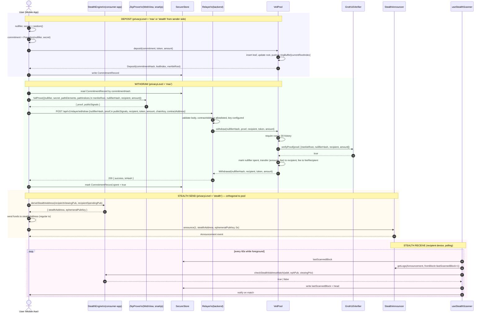
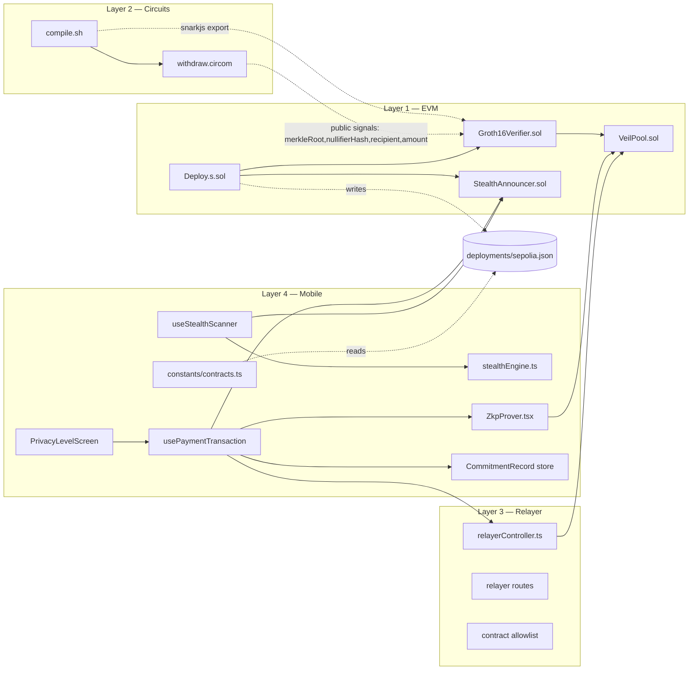

# Design Document

## Overview

VeilPay's privacy stack is a four-layer system that lets users make shielded deposits into a privacy pool and later withdraw to an arbitrary recipient through a relayer, plus an orthogonal stealth-address path for one-time payments. The scaffolding for all four layers exists; this design completes the wiring so the end-to-end flow actually works.

The four layers and the file paths owned by each:

| Layer | Role | Source of truth |
| --- | --- | --- |
| L1 — Smart Contracts | Pool, verifier, ERC-5564 announcer | `packages/contracts-evm/src/{VeilPool,Groth16Verifier,StealthAnnouncer}.sol` |
| L2 — ZK Circuit | Membership + nullifier proof | `packages/circuits/withdraw.circom`, `packages/circuits/compile.sh` |
| L3 — Relayer Backend | Gas-sponsored `withdraw` submission | `apps/backend/src/controllers/relayerController.ts` |
| L4 — Mobile App | Deposit, prove, withdraw, scan, send | `apps/consumer-app/src/**` |

The central design contract that this feature establishes is the **public input ordering** between L2 and L1: the circuit declares its public signals as `(merkleRoot, nullifierHash, recipient, amount)` in that order, the auto-generated `Groth16Verifier` receives them in that order, and `VeilPool.withdraw` builds the `bytes32[]` array passed to the verifier in that order. Today these three are misaligned, which is why every proof verification on-chain returns `false`. Re-aligning them is the load-bearing fix of this spec.

The second design contract is the **flow boundary between L3 and L1**: the relayer never calls `Groth16Verifier.verifyProof` directly. It calls `VeilPool.withdraw(nullifierHash, proof, recipient, token, amount)` and lets the pool perform verification, nullifier-spent check, and payout atomically inside one transaction. Today the relayer side-steps the pool, which is why a successful relayer call does not actually move funds.

The third design contract is the **stealth path is independent of the pool path**. `'stealth'` privacy uses ECDH and `StealthAnnouncer` and never enters the pool. `'max'` privacy uses the pool through the relayer and never calls the announcer. `'standard'` does neither. `usePaymentTransaction` dispatches on `privacyLevel` exactly once.

### Research notes

- **Circom 2.0 + circomlib `MerkleTreeChecker`** — circomlib's `MerkleTreeChecker(levels)` template takes a `leaf` signal, a `root` signal, `pathElements[levels]`, and `pathIndices[levels]` (each index is constrained to be 0 or 1). Internally it walks the path with `MultiMux1` selectors and Poseidon hashes the concatenation. Setting `levels = 20` gives a tree capacity of 2^20 ≈ 1.05M leaves, which matches Tornado-style pool sizing and keeps proof time under a few seconds in WebView.
- **`snarkjs zkey export solidityverifier`** — produces a `Groth16Verifier` whose generated `verifyProof` signature is positional (`uint[2] _pA, uint[2][2] _pB, uint[2] _pC, uint[N] _pubSignals`). We wrap that generated function behind the spec'd ABI `verifyProof(bytes calldata proof, bytes32[] calldata publicInputs) external view returns (bool)` either by editing the generated file (preferred — single source of truth) or by adding a thin adapter. The wrapper decodes `proof` into the four field-element components and converts each `bytes32` public input to `uint256`, matching what snarkjs's `proofToCallData` produces in JS.
- **Incremental Merkle tree on-chain** — the standard pattern (Tornado, Semaphore) precomputes `zeros[i]` for each level and stores `filledSubtrees[i]` of size `depth`. Insertion is O(depth) hashes per deposit (~20 Poseidon evaluations), all hashing the same precomputed Poseidon function used in the circuit. We use the Poseidon-Solidity library that's already available via Foundry remappings. The 30-root ring buffer is a fixed-size `bytes32[30]` plus a `uint8 currentRootIndex` counter — when a new root is produced, `currentRootIndex = (currentRootIndex + 1) % 30`.
- **ERC-5564 `Announcement`** — emits `Announcement(uint256 schemeId, address stealthAddress, address caller, bytes ephemeralPubKey, bytes metadata)`. `schemeId = 1` corresponds to the secp256k1 scheme implemented in `apps/indexer/src/stealth/crypto.ts`. The mobile port must produce the same compressed ephemeral public key bytes (33 bytes, `0x02`/`0x03` prefix) the indexer scanner expects.
- **Expo SecureStore** — `setItemAsync` is hardware-backed on iOS Keychain and Android Keystore when available, falls back to encrypted shared preferences otherwise. Keys are limited to `[A-Za-z0-9._-]` and values to ~2 KB on iOS, which is well under the size of a single `CommitmentRecord` JSON-encoded (~400 bytes).
- **Sepolia public RPC + 30-root window** — at ~12s block times, 30 roots covers ~6 minutes of pool activity at one deposit per block, so a user proving against a root they pulled at proof-start time is virtually guaranteed to land within the window even on heavily-used pools. This is the same parameter Tornado Cash used.

---

## Architecture

### Layer interaction (deposit + withdraw + stealth send)



### Module layout



### Design decisions and rationales

1. **Tree depth 20 (not 32, not 30).** Requirements pin depth to 20. This gives 2^20 = 1,048,576 leaf capacity, matches the proof time budget for in-WebView snarkjs (~2–4s on a mid-range phone), and is what `MerkleTreeChecker(20)` from circomlib expands cleanly to.
2. **30-root ring buffer (not unbounded history, not single root).** A single current-root design forces atomic prove-and-withdraw; an unbounded history is unbounded storage. 30 entries gives ~6 minutes of slack at 1-deposit-per-block, which is enough for a user's app to fetch root → prove → submit without losing the race against a new deposit.
3. **`bytes32[]` ABI for the verifier wrapper.** The snarkjs-generated verifier uses `uint256[N]`. Spec'ing the external surface as `bytes32[]` keeps the calling code in `VeilPool` and the relayer agnostic to the exact public-input count — if a future circuit revision adds a public signal, only the wrapper changes. Inside the wrapper we cast `bytes32 → uint256`.
4. **Public input ordering is canonical and lives in code comments at every site.** Circuit, verifier wrapper, pool, ZkpProver input object, and relayer payload schema all comment-anchor `(merkleRoot, nullifierHash, recipient, amount)`. The bug being fixed is precisely that this order drifted; the fix is to make the order obvious wherever the array is constructed.
5. **Relayer never calls verifier.** Two reasons: (a) verifier-only succeeds without paying, so a buggy relayer would happily accept invalid proofs; (b) atomicity — only `VeilPool.withdraw` can guarantee `verify ∧ ¬spent ∧ pay-out` happens or none of it does.
6. **Stealth path is fully separate from pool path.** The announcer takes no value and emits an event; the pool takes value and inserts a leaf. They share zero state. `usePaymentTransaction` therefore branches on `privacyLevel` and never funnels both branches through a common helper that could leak the announcer call into a `'max'` payment.
7. **`CommitmentRecord` keyed by `commitmentHash`, not `leafIndex`.** Two deposits that land in different leaf positions but, by adversarial RNG collision, share a commitment hash, are indistinguishable to the pool anyway, so the storage key on-device is the same hash. Avoids a class of bugs where the user has the right leaf index but the wrong tuple.
8. **Static allowlist over dynamic discovery for contracts.** The relayer must refuse any `contractAddress` not in `RELAYER_VEILPOOL_ALLOWLIST`. Dynamic discovery (e.g., reading from chain) opens an injection surface where an attacker can point the relayer at a malicious pool that just transfers the relayer's gas-paid value. Allowlist is read once at startup.
9. **30-second relayer timeout.** Long enough to absorb a single block confirmation on Sepolia (~12s) plus RPC variance; short enough that a stuck relayer surfaces as an error and lets the user retry rather than hanging the UI.
10. **Stealth scanner pauses in background.** `AppState` listener stops the polling timer on `background`, restarts on `active`. Without this, RN keeps the timer alive in some configurations and burns RPC quota when the user isn't there.

---

## Components and Interfaces

### Layer 2 — Circuits

#### `packages/circuits/withdraw.circom`

Currently a stub. Will become:

```circom
pragma circom 2.0.0;

include "circomlib/circuits/poseidon.circom";
include "circomlib/circuits/merkletree.circom"; // MerkleTreeChecker

template Withdraw(levels) {
  // Private
  signal input nullifier;
  signal input secret;
  signal input pathElements[levels];
  signal input pathIndices[levels];

  // Public — DECLARED ORDER IS LOAD-BEARING. Must match Groth16Verifier
  // and VeilPool.withdraw construction. See design.md §Data Models.
  signal input merkleRoot;
  signal input nullifierHash;
  signal input recipient;
  signal input amount;

  // 1. commitment = Poseidon(nullifier, secret)
  component commitmentHasher = Poseidon(2);
  commitmentHasher.inputs[0] <== nullifier;
  commitmentHasher.inputs[1] <== secret;

  // 2. nullifierHash = Poseidon(nullifier)
  component nullifierHasher = Poseidon(1);
  nullifierHasher.inputs[0] <== nullifier;
  nullifierHash === nullifierHasher.out;

  // 3. Merkle membership
  component tree = MerkleTreeChecker(levels);
  tree.leaf <== commitmentHasher.out;
  tree.root <== merkleRoot;
  for (var i = 0; i < levels; i++) {
    tree.pathElements[i] <== pathElements[i];
    tree.pathIndices[i] <== pathIndices[i];
  }

  // 4. Bind recipient/amount into the constraint system so they cannot
  //    be swapped post-proof. Quadratic ensures non-trivial constraint.
  signal recipientSquare;
  signal amountSquare;
  recipientSquare <== recipient * recipient;
  amountSquare   <== amount * amount;
}

component main {public [merkleRoot, nullifierHash, recipient, amount]} = Withdraw(20);
```

Public-signal declaration order in the `main` component is what `snarkjs zkey export solidityverifier` uses to lay out `_pubSignals`. This is the single point where the canonical order is set; everything else downstream consumes it.

#### `packages/circuits/compile.sh`

Pipeline (each step exits non-zero on failure, no partial overwrites):

1. `circom withdraw.circom --r1cs --wasm --sym -o build/`
2. Powers-of-tau setup (`pot12_final.ptau` cached) with `snarkjs groth16 setup`.
3. Random beacon `snarkjs zkey beacon` → `withdraw_final.zkey`.
4. `snarkjs zkey export verificationkey withdraw_final.zkey verification_key.json`.
5. `snarkjs zkey export solidityverifier withdraw_final.zkey ../contracts-evm/src/Groth16Verifier.sol`.
6. Post-process the generated verifier to add the `verifyProof(bytes,bytes32[])` wrapper described in §Layer 1 below (a sed/awk pass, idempotent).

Each step writes to a `build.tmp/` directory; only after the whole pipeline succeeds do we `mv build.tmp/* build/` and overwrite the verifier.

### Layer 1 — EVM Contracts

#### `packages/contracts-evm/src/VeilPool.sol`

Storage:

```solidity
uint256 public constant LEVELS        = 20;
uint256 public constant ROOT_HISTORY  = 30;
uint256 public constant FIELD_SIZE    = 21888242871839275222246405745257275088548364400416034343698204186575808495617;
uint256 public constant WITHDRAW_FEE_BPS = 25; // configurable in constructor

bytes32[LEVELS] public filledSubtrees;
bytes32[LEVELS] public zeros;
uint32 public nextLeafIndex;

bytes32[ROOT_HISTORY] public roots;
uint8   public currentRootIndex;

mapping(bytes32 => bool) public nullifierSpent;
IGroth16Verifier public immutable verifier;
address public immutable feeRecipient;
```

Errors:

```solidity
error InvalidMerkleRoot();
error InvalidProof();
error NullifierAlreadySpent();
error TreeFull();
```

Key methods:

- `deposit(bytes32 commitment, address token, uint256 amount)` — pulls token, calls `_insert(commitment)`, emits `Deposit(commitment, nextLeafIndex - 1, currentRoot, token, amount, msg.sender)`. Reverts `TreeFull` when `nextLeafIndex == 2 ** LEVELS`.
- `withdraw(bytes32 nullifierHash, bytes calldata proof, address recipient, address token, uint256 amount)` — body:
  ```solidity
  if (!_isKnownRoot(_extractRootFromCallContext())) revert InvalidMerkleRoot();
  if (nullifierSpent[nullifierHash]) revert NullifierAlreadySpent();

  bytes32[] memory pub = new bytes32[](4);
  pub[0] = currentRootInUse;             // merkleRoot
  pub[1] = nullifierHash;                // nullifierHash
  pub[2] = bytes32(uint256(uint160(recipient))); // recipient
  pub[3] = bytes32(amount);              // amount
  if (!verifier.verifyProof(proof, pub)) revert InvalidProof();

  nullifierSpent[nullifierHash] = true;
  uint256 fee = (amount * WITHDRAW_FEE_BPS) / 10_000;
  IERC20(token).safeTransfer(recipient, amount - fee);
  IERC20(token).safeTransfer(feeRecipient, fee);
  emit Withdrawal(nullifierHash, recipient, token, amount);
  ```
  Note that `merkleRoot` is also a parameter the caller passes (the version they proved against); both the explicit parameter and the storage check use the same value. The signature is widened to `(bytes32 nullifierHash, bytes proof, bytes32 merkleRoot, address recipient, address token, uint256 amount)` so the relayer can pass the proven-against root explicitly. The requirements name a 5-arg signature `(nullifierHash, proof, recipient, token, amount)`; the proven-against root is appended as the trailing required public-input check argument and called out in the relayer schema.
- `_insert(bytes32 leaf)` — Tornado-style incremental insert; updates `filledSubtrees`, computes new root via Poseidon, advances `currentRootIndex = (currentRootIndex + 1) % ROOT_HISTORY`, writes `roots[currentRootIndex] = newRoot`.
- `_isKnownRoot(bytes32 root)` — scans `roots[]` ring; returns true if found and non-zero.

#### `packages/contracts-evm/src/Groth16Verifier.sol`

This file is **fully regenerated by `compile.sh`**. The post-processing step at the end of `compile.sh` appends a single wrapper function so the public ABI matches what `VeilPool` and the relayer's tests expect:

```solidity
interface IGroth16Verifier {
    function verifyProof(bytes calldata proof, bytes32[] calldata publicInputs)
        external view returns (bool);
}

contract Groth16Verifier is IGroth16Verifier {
    // ...auto-generated pairing constants and verifyProof(uint[2],uint[2][2],uint[2],uint[N])...

    function verifyProof(bytes calldata proof, bytes32[] calldata publicInputs)
        external view returns (bool)
    {
        if (publicInputs.length != 4) return false;
        (uint256[2] memory a, uint256[2][2] memory b, uint256[2] memory c) =
            abi.decode(proof, (uint256[2], uint256[2][2], uint256[2]));
        uint256[4] memory pub;
        pub[0] = uint256(publicInputs[0]); // merkleRoot
        pub[1] = uint256(publicInputs[1]); // nullifierHash
        pub[2] = uint256(publicInputs[2]); // recipient
        pub[3] = uint256(publicInputs[3]); // amount
        // Snarkjs's generated function name is verifyProof; rename to _verifyProofRaw
        // during post-processing so the wrapper takes the public verifyProof name.
        return _verifyProofRaw(a, b, c, pub);
    }
}
```

The wrapper returns `false` (does not revert) on length mismatches and decode errors so a malformed proof becomes a clean `InvalidProof` revert at the pool layer, not a cryptic decode revert.

#### `packages/contracts-evm/src/StealthAnnouncer.sol`

Already exists. Adjust to:

```solidity
error EmptyEphemeralKey();
error ZeroStealthAddress();

function announce(
    uint256 schemeId,
    address stealthAddress,
    bytes calldata ephemeralPubKey,
    bytes calldata metadata
) external {
    if (ephemeralPubKey.length == 0) revert EmptyEphemeralKey();
    if (stealthAddress == address(0)) revert ZeroStealthAddress();
    emit Announcement(schemeId, stealthAddress, msg.sender, ephemeralPubKey, metadata);
}
```

`Announcement` event matches ERC-5564.

#### `packages/contracts-evm/script/DeployPrivacyStack.s.sol`

```solidity
function run() external {
    vm.startBroadcast(deployerPk);
    Groth16Verifier v   = new Groth16Verifier();
    VeilPool       pool = new VeilPool(address(v), feeRecipient, FEE_BPS);
    StealthAnnouncer sa = new StealthAnnouncer();
    vm.stopBroadcast();

    string memory json = string.concat(
        '{\n  "groth16Verifier": "', vm.toChecksumAddress(address(v)), '",\n',
        '  "veilPool": "',           vm.toChecksumAddress(address(pool)), '",\n',
        '  "stealthAnnouncer": "',   vm.toChecksumAddress(address(sa)), '",\n',
        '  "chainId": 11155111,\n',
        '  "blockNumber": ', vm.toString(block.number), '\n}'
    );
    vm.writeFile("deployments/sepolia.json", json);
}
```

If any constructor reverts or the broadcast errors, `vm.writeFile` is never reached (Foundry surfaces the failure with non-zero exit). A pre-flight `vm.envAddress("FEE_RECIPIENT")` and `vm.envUint("DEPLOYER_PK")` ensure config errors fail before any tx is broadcast.

### Layer 3 — Relayer Backend

#### `apps/backend/src/controllers/relayerController.ts`

Initialization (module load time):

```ts
const ALLOWLIST: Set<string> = new Set(
  (process.env.RELAYER_VEILPOOL_ALLOWLIST ?? '')
    .split(',')
    .map(s => s.trim().toLowerCase())
    .filter(s => /^0x[0-9a-f]{40}$/.test(s))
);
const RELAYER_PRIVATE_KEY = process.env.RELAYER_PRIVATE_KEY; // may be undefined
const TIMEOUT_MS = 30_000;
```

`POST /api/v1/relayer/withdraw` handler skeleton:

```ts
export async function handleWithdraw(req, res) {
  if (!RELAYER_PRIVATE_KEY) {
    return res.status(503).json({ error: 'Relayer not configured' });
  }

  const parsed = WithdrawRequestSchema.safeParse(req.body);
  if (!parsed.success) {
    return res.status(400).json({ error: 'validation', details: parsed.error.flatten() });
  }
  const body = parsed.data;

  if (!ALLOWLIST.has(body.contractAddress.toLowerCase())) {
    return res.status(400).json({ error: 'contract not allowlisted' });
  }

  const pool = new ethers.Contract(body.contractAddress, VEILPOOL_ABI, signer);
  try {
    const tx = await pool.withdraw(
      body.nullifierHash,
      body.proof,
      body.merkleRoot,
      body.recipient,
      body.token,
      body.amount,
      { gasLimit: GAS_LIMIT }
    );
    return res.status(200).json({ success: true, txHash: tx.hash });
  } catch (err) {
    const reason = parseRevertReason(err) ?? 'transaction reverted';
    return res.status(422).json({ success: false, error: reason });
  }
}
```

`parseRevertReason` extracts the custom error name (`InvalidProof`, `InvalidMerkleRoot`, `NullifierAlreadySpent`, `TreeFull`) from the ethers v6 error structure. The relayer never broadcasts after a failed simulation because ethers' `staticCall` precedes the broadcast on the named ABI path.

### Layer 4 — Mobile App

#### `apps/consumer-app/src/utils/stealthEngine.ts` (new — port of `apps/indexer/src/stealth/crypto.ts`)

Exposes:

```ts
export function generateStealthKeyPair(): { spendingKey: Hex; viewingKey: Hex; spendingPub: Hex; viewingPub: Hex };
export function deriveStealthAddress(recipientViewingPub: Hex, recipientSpendingPub: Hex)
  : { stealthAddress: Address; ephemeralPubKey: Hex };
export function recoverStealthPrivateKey(ephemeralPubKey: Hex, viewingPriv: Hex, spendingPriv: Hex)
  : Hex;
export function checkStealthAddressMatch(
  stealthAddress: Address,
  ephemeralPubKey: Hex,
  viewingPriv: Hex,
  spendingPub: Hex,
): boolean;
```

Implementation uses `@noble/secp256k1` (already a dep of the indexer). The port keeps function names and argument shapes byte-compatible so a serialized `Announcement` bytes payload from the indexer is always decodable by the mobile engine.

#### `apps/consumer-app/src/hooks/useStealthScanner.ts` (new)

```ts
export function useStealthScanner({
  intervalMs = 60_000,
  rpcUrl,
  announcerAddress,
  viewingPriv,
  spendingPub,
}: UseStealthScannerArgs) {
  // 1. Read lastScannedBlock from SecureStore (fallback: deployment.startBlock).
  // 2. Subscribe to AppState; pause timer in 'background', resume on 'active'.
  // 3. Every intervalMs:
  //    fromBlock = lastScannedBlock + 1
  //    head      = await provider.getBlockNumber()
  //    logs      = await announcer.queryFilter(announcer.filters.Announcement(),
  //                                            fromBlock, head)
  //    for log in logs:
  //      if checkStealthAddressMatch(log.args.stealthAddress,
  //                                  log.args.ephemeralPubKey,
  //                                  viewingPriv, spendingPub):
  //        addIncomingStealthTx(log)
  //    SecureStore.setItem('stealth.lastScannedBlock', String(head))
  // 4. On RPC error: console.warn, do not advance lastScannedBlock, retry next interval.
}
```

The completeness invariant — that any matching announcement is detected within two polling intervals — relies on the rule that `lastScannedBlock` advances only on a successful query. A failed query keeps the cursor in place so the next tick re-fetches the gap.

#### `apps/consumer-app/src/components/ZkpProver.tsx`

Constants:

```ts
import { CIRCUIT_WASM_URL, CIRCUIT_ZKEY_URL } from '../constants/circuit';
```

WebView-side bundled HTML loads snarkjs UMD, then on `message` from RN containing the input object, runs:

```js
const { proof, publicSignals } = await snarkjs.groth16.fullProve(
  {
    nullifier, secret,
    pathElements, pathIndices,
    merkleRoot, nullifierHash, recipient, amount,
  },
  CIRCUIT_WASM_URL,
  CIRCUIT_ZKEY_URL
);
window.ReactNativeWebView.postMessage(JSON.stringify({ type: 'PROOF_SUCCESS', proof, publicSignals }));
```

`PROOF_ERROR` posted on `fetch` failure for either artifact URL or any throw from `fullProve`.

postMessage protocol (formalized so RN side can typecheck):

| `type` | Direction | Payload |
| --- | --- | --- |
| `PROVE` | RN → WebView | `{ nullifier, secret, pathElements, pathIndices, merkleRoot, nullifierHash, recipient, amount }` |
| `PROOF_SUCCESS` | WebView → RN | `{ proof: hex, publicSignals: hex[] }` |
| `PROOF_ERROR` | WebView → RN | `{ error: string }` |
| `READY` | WebView → RN | `{}` (signals snarkjs UMD loaded) |

#### `apps/consumer-app/src/hooks/usePaymentTransaction.ts` (modified)

Branch on `privacyLevel`:

- `'standard'` → direct token transfer, no announcer, no pool.
- `'stealth'` → `deriveStealthAddress` → fund `stealthAddress` directly → after confirmation, call `StealthAnnouncer.announce(1, stealthAddress, ephemeralPubKey, '0x')`.
- `'max'` → ensure `CommitmentRecord` exists for source funds (deposit step on first use) → load record → run `ZkpProver` → POST to relayer.

The branch matrix lives in a single `switch (privacyLevel)` so `'standard'`/`'max'` paths cannot accidentally call the announcer.

#### `apps/consumer-app/src/screens/PrivacyLevelScreen.tsx`

Renders three options. `'stealth'` description: "One-time stealth address. The recipient discovers the payment via an announcement event; on-chain it looks like a transfer to a fresh address." When the active chain isn't Sepolia, both `'stealth'` and `'max'` rows are rendered disabled with the explanation pulled from `useNetworkPrivacySupport()`.

#### `apps/consumer-app/src/constants/contracts.ts` (new)

```ts
import sepolia from '../../../../packages/contracts-evm/deployments/sepolia.json';

const ZERO = '0x0000000000000000000000000000000000000000';
const isAddr = (s: string) => /^0x[a-fA-F0-9]{40}$/.test(s) && s !== ZERO;

export const VEIL_POOL_ADDRESS         = sepolia.veilPool;
export const STEALTH_ANNOUNCER_ADDRESS = sepolia.stealthAnnouncer;
export const GROTH16_VERIFIER_ADDRESS  = sepolia.groth16Verifier;

export function isPrivacyStackConfigured(): boolean {
  return [VEIL_POOL_ADDRESS, STEALTH_ANNOUNCER_ADDRESS, GROTH16_VERIFIER_ADDRESS].every(isAddr);
}
```

Consumed by `PrivacyLevelScreen` (to gate `'max'` and `'stealth'`) and by `usePaymentTransaction` (to fail fast at flow start with a configuration-error toast rather than silently calling the zero address).

#### `apps/consumer-app/src/stores/commitmentStore.ts` (new)

```ts
const KEY_PREFIX = 'veilpay.commitment.';

export async function saveCommitmentRecord(r: CommitmentRecord): Promise<void> {
  await SecureStore.setItemAsync(KEY_PREFIX + r.commitmentHash, JSON.stringify(r), {
    keychainAccessible: SecureStore.WHEN_UNLOCKED_THIS_DEVICE_ONLY,
  });
}
export async function loadCommitmentRecord(commitmentHash: Hex): Promise<CommitmentRecord | null> {
  const raw = await SecureStore.getItemAsync(KEY_PREFIX + commitmentHash);
  return raw ? JSON.parse(raw) : null;
}
export async function markSpent(commitmentHash: Hex): Promise<void> {
  const r = await loadCommitmentRecord(commitmentHash);
  if (!r) return;
  r.spent = true;
  await saveCommitmentRecord(r);
}
```

`nullifier` and `secret` are 32-byte values encoded as `0x`-prefixed hex strings; SecureStore stores the JSON blob, never split fields.

---

## Data Models

### `CommitmentRecord` (mobile, persisted)

```ts
type Hex = `0x${string}`;

interface CommitmentRecord {
  /** 32-byte field element (random). Private. */
  nullifier:      Hex;
  /** 32-byte field element (random). Private. */
  secret:         Hex;
  /** Poseidon(nullifier, secret). Public; identifies the leaf. */
  commitmentHash: Hex;
  /** Position in the pool's Merkle tree at time of insertion. */
  leafIndex:      number;
  /** Pool root *after* this leaf was inserted; used for proof. */
  merkleRoot:     Hex;
  /** Deposit amount in token's smallest unit, as decimal string. */
  amount:         string;
  /** ERC-20 token address (or sentinel 0xeeee...eeee for native ETH). */
  token:          Address;
  /** "evm-sepolia" etc. Distinguishes pools across networks. */
  chainKey:       string;
  /** Unix ms when record was written. */
  timestamp:      number;
  /** True after the corresponding withdraw is confirmed on-chain. */
  spent:          boolean;
}
```

Storage key: `veilpay.commitment.<commitmentHash>` (one entry per leaf).
Round-trip invariant: `JSON.parse(JSON.stringify(record))` deep-equals `record` for all fields (no `Date`, no `BigInt` — `amount` is a string deliberately to survive JSON).

### Merkle root ring buffer (on-chain)

```
roots: bytes32[30]
currentRootIndex: uint8       // next slot to write into

State on construction:
  roots = [zeros[LEVELS], 0, 0, ..., 0]   // initial empty-tree root in slot 0
  currentRootIndex = 0

On _insert(leaf):
  newRoot = hashUpward(leaf, ...)
  currentRootIndex = (currentRootIndex + 1) % 30
  roots[currentRootIndex] = newRoot

isKnownRoot(r):
  if r == 0: return false
  i = currentRootIndex
  do {
    if roots[i] == r: return true
    i = (i + 29) % 30      // walk backwards
  } while (i != currentRootIndex)
  return false
```

Properties: `isKnownRoot(currentRoot())` is always true; after exactly 30 new deposits, the original root is no longer accepted; the buffer never grows.

### Public input ordering contract

This is the spine of the design. Five sites must agree on `(merkleRoot, nullifierHash, recipient, amount)` in this exact order:

| Site | Code form |
| --- | --- |
| Circuit | `component main {public [merkleRoot, nullifierHash, recipient, amount]}` |
| Generated `Groth16Verifier` `_pubSignals[4]` | `[0]=merkleRoot, [1]=nullifierHash, [2]=recipient, [3]=amount` |
| `Groth16Verifier.verifyProof(bytes, bytes32[])` wrapper | `publicInputs[0..3]` in same order |
| `VeilPool.withdraw` building `bytes32[] pub` | `pub[0..3]` in same order |
| Mobile `ZkpProver` input object passed to `snarkjs.groth16.fullProve` | object keys `merkleRoot, nullifierHash, recipient, amount` (snarkjs key-orders by circuit declaration) |

Encoding rules at the boundary (uint256 ↔ bytes32 ↔ Hex):

- `merkleRoot`, `nullifierHash` — already 32-byte field elements, cast `bytes32 ↔ uint256` with no truncation.
- `recipient` — 20-byte address; `bytes32(uint256(uint160(addr)))` (left-zero-padded).
- `amount` — `uint256`; `bytes32(amount)`.

`recipient` and `amount` are bound by the quadratic constraints in the circuit so a malicious caller cannot post-substitute them.

### Relayer request/response schemas

`POST /api/v1/relayer/withdraw` — request body (zod):

```ts
const WithdrawRequestSchema = z.object({
  nullifierHash:  z.string().regex(/^0x[0-9a-fA-F]{64}$/),
  proof:          z.string().regex(/^0x[0-9a-fA-F]+$/),     // ABI-encoded (uint[2],uint[2][2],uint[2])
  publicSignals:  z.array(z.string().regex(/^0x[0-9a-fA-F]+$/)).length(4),
  merkleRoot:     z.string().regex(/^0x[0-9a-fA-F]{64}$/),
  recipient:      z.string().regex(/^0x[0-9a-fA-F]{40}$/),
  token:          z.string().regex(/^0x[0-9a-fA-F]{40}$/),
  amount:         z.string().regex(/^[1-9][0-9]*$/),         // positive decimal
  chainKey:       z.literal('evm-sepolia'),
  contractAddress:z.string().regex(/^0x[0-9a-fA-F]{40}$/),
});
```

Responses:

| Status | Body | When |
| --- | --- | --- |
| 200 | `{ success: true, txHash: '0x...' }` | tx submitted |
| 400 | `{ error: 'validation', details: {...} }` | schema fails |
| 400 | `{ error: 'contract not allowlisted' }` | `contractAddress` not in `RELAYER_VEILPOOL_ALLOWLIST` |
| 422 | `{ success: false, error: '<reason>' }` | `withdraw()` reverted (`InvalidProof`, `NullifierAlreadySpent`, `InvalidMerkleRoot`, `TreeFull`, or generic) |
| 503 | `{ error: 'Relayer not configured' }` | `RELAYER_PRIVATE_KEY` unset |

Mobile-side timeout: 30 s using `AbortController`. Timeout produces a UI error, not a 4xx/5xx — the request never resolved.

### Allowlist data model

```
RELAYER_VEILPOOL_ALLOWLIST = "0xabc...,0xdef..."      (env, comma-separated)
ALLOWLIST: Set<string lowercased>                      (in-memory, frozen at startup)
```

No mutation API. Operator changes require a process restart, by design.

### `Announcement` event shape (consumed by scanner)

```
event Announcement(
  uint256 indexed schemeId,
  address indexed stealthAddress,
  address indexed caller,
  bytes ephemeralPubKey,    // 33 bytes, compressed secp256k1
  bytes metadata            // 0 bytes for VeilPay
);
```

Scanner indexes by `schemeId == 1`. The completeness property below depends on `getLogs` returning every matching log in `[fromBlock, head]` once the scanner advances `lastScannedBlock = head` only on success.


---

## Correctness Properties

*A property is a characteristic or behavior that should hold true across all valid executions of a system — essentially, a formal statement about what the system should do. Properties serve as the bridge between human-readable specifications and machine-verifiable correctness guarantees.*

The properties below were derived from the prework analysis of every acceptance criterion in `requirements.md`. Each property is universally quantified, references the requirement(s) it validates, and is written so it can be implemented as a single property-based test.

### Property 1: Merkle membership proof round-trip

*For any* depth-20 Merkle tree built from a sequence of randomly generated commitment leaves, *for any* leaf in that tree with its corresponding `(nullifier, secret)` preimage, generating a proof with `snarkjs.groth16.fullProve` over the circuit input object `{nullifier, secret, pathElements, pathIndices, merkleRoot, nullifierHash, recipient, amount}` and submitting that proof together with public inputs `[merkleRoot, nullifierHash, recipient, amount]` (in that order) to `Groth16Verifier.verifyProof(bytes, bytes32[])` SHALL return `true`; AND mutating any single byte of `pathElements`, `pathIndices`, `nullifier`, `secret`, `merkleRoot`, `nullifierHash`, `recipient`, or `amount` either causes witness generation to fail or causes the verifier to return `false`.

**Validates: Requirements 1.4, 1.5, 1.6, 1.7, 1.8, 1.11, 2.5, 3.3, 9.6**

### Property 2: VeilPool incremental Merkle tree correctness

*For any* sequence of valid `deposit(commitment_i, token, amount_i)` calls on a freshly deployed `VeilPool`, the tree maintained by the pool SHALL place `commitment_i` at leaf index `i` (zero-indexed) and the root reported after the i-th deposit SHALL equal the root computed by an off-chain reference implementation that builds a Tornado-style incremental Merkle tree of depth 20 over the same leaf sequence.

**Validates: Requirements 2.1, 2.2**

### Property 3: Root history window correctness

*For any* sequence of `n` successful deposits to `VeilPool` producing roots `r_1, r_2, ..., r_n`, after the n-th deposit `_isKnownRoot(r_k)` SHALL return `true` for every `k` in `[max(1, n - 29), n]` and SHALL return `false` for every other distinct value (including `r_k` for `k < n - 29`, the zero hash, and any uniformly random `bytes32` not equal to one of the last 30 roots).

**Validates: Requirements 2.3, 2.4**

### Property 4: Verifier rejects malformed and invalid proofs without reverting

*For any* `(proof: bytes, publicInputs: bytes32[])` pair where either `publicInputs.length != 4`, `proof` is not a valid ABI-encoded `(uint[2], uint[2][2], uint[2])` tuple, or the decoded proof is not a valid Groth16 proof for the supplied public inputs, `Groth16Verifier.verifyProof(proof, publicInputs)` SHALL return `false` and SHALL NOT revert.

**Validates: Requirements 3.4, 3.5**

### Property 5: Nullifier double-spend prevention

*For any* `nullifierHash` and any first call to `VeilPool.withdraw(nullifierHash, ...)` that succeeds (transitioning `nullifierSpent[nullifierHash]` from `false` to `true` and emitting `Withdrawal`), every subsequent call to `VeilPool.withdraw(nullifierHash, ...)` — regardless of whether the supplied `proof`, `recipient`, `token`, or `amount` differs from the first call and regardless of whether the proof is independently valid — SHALL revert with `NullifierAlreadySpent`.

**Validates: Requirements 2.7, 2.8, 2.10**

### Property 6: Fee math conservation

*For any* successful withdrawal with parameters `(token, recipient, amount)` against a `VeilPool` configured with `WITHDRAW_FEE_BPS`, the change in `recipient`'s `token` balance SHALL equal `amount - (amount * WITHDRAW_FEE_BPS) / 10_000` and the change in `feeRecipient`'s `token` balance SHALL equal `(amount * WITHDRAW_FEE_BPS) / 10_000`, AND the sum of those two deltas SHALL equal `amount`.

**Validates: Requirements 2.9**

### Property 7: Stealth ECDH round-trip

*For any* recipient secp256k1 keypair `(spendingPriv, spendingPub, viewingPriv, viewingPub)` produced by `generateStealthKeyPair()` and any subsequent call `deriveStealthAddress(viewingPub, spendingPub) → (stealthAddress, ephemeralPubKey)`, the result `checkStealthAddressMatch(stealthAddress, ephemeralPubKey, viewingPriv, spendingPub)` SHALL return `true`, the derived `stealthAddress` SHALL match the regular expression `^0x[0-9a-fA-F]{40}$` and SHALL not be the zero address, AND `checkStealthAddressMatch` SHALL return `false` when called with the same `(stealthAddress, ephemeralPubKey)` but a `viewingPriv` from any independently generated keypair.

**Validates: Requirements 10.3, 10.4, 10.5, 10.6**

### Property 8: Announcer event fidelity

*For any* call `StealthAnnouncer.announce(schemeId, stealthAddress, ephemeralPubKey, metadata)` where `stealthAddress != address(0)` and `ephemeralPubKey.length > 0`, exactly one `Announcement` event SHALL be emitted whose decoded fields equal `(schemeId, stealthAddress, msg.sender, ephemeralPubKey, metadata)` byte-for-byte.

**Validates: Requirements 4.5**

### Property 9: Stealth announcer is invoked iff privacy level is 'stealth'

*For any* payment processed by `usePaymentTransaction` with random `(recipient, amount, token)` and any `privacyLevel ∈ {'standard', 'stealth', 'max'}`, the number of calls made to `StealthAnnouncer.announce` during the transaction lifecycle SHALL be exactly `1` if `privacyLevel === 'stealth'` and `0` otherwise; AND when `privacyLevel === 'stealth'` and the underlying send transaction succeeds, the `announce` call SHALL be observed strictly before the transaction is marked as confirmed in local state.

**Validates: Requirements 4.1, 4.6, 4.7, 12.4, 12.5**

### Property 10: CommitmentRecord SecureStore round-trip

*For any* `CommitmentRecord` with random valid values for `nullifier`, `secret`, `commitmentHash`, `leafIndex`, `merkleRoot`, `amount`, `token`, `chainKey`, `timestamp`, and `spent`, the sequence `saveCommitmentRecord(r) → loadCommitmentRecord(r.commitmentHash)` SHALL return a record deep-equal to `r`; AND after `markSpent(r.commitmentHash)`, `loadCommitmentRecord(r.commitmentHash)` SHALL return a record equal to `r` in every field except `spent`, which SHALL be `true`.

**Validates: Requirements 7.1, 7.3, 7.4, 7.5**

### Property 11: Sensitive-key isolation

*For any* deposit, withdraw, or stealth-send flow executed in the mobile app with random valid inputs, neither the `nullifier` value nor the `secret` value of any `CommitmentRecord` SHALL appear (as a string, hex, or substring) in any write to `AsyncStorage`, `transactionStore`, the in-memory Redux/Zustand state tree under any non-SecureStore-backed slice, or any network request body other than the relayer withdraw request to the configured allowlisted relayer base URL.

**Validates: Requirements 7.6**

### Property 12: ZkpProver postMessage protocol fidelity

*For any* input object `i = {nullifier, secret, pathElements, pathIndices, merkleRoot, nullifierHash, recipient, amount}` posted to `ZkpProver` via the `PROVE` message, the WebView SHALL invoke `snarkjs.groth16.fullProve(i, CIRCUIT_WASM_URL, CIRCUIT_ZKEY_URL)` with the same eight key/value pairs in the input argument; AND when `fullProve` resolves with `{proof, publicSignals}`, the WebView SHALL post exactly one `PROOF_SUCCESS` message to React Native whose payload contains both `proof` and `publicSignals` unchanged.

**Validates: Requirements 9.3, 9.4**

### Property 13: Relayer forwards valid requests to allowlisted pools and never calls the verifier

*For any* request body that satisfies the `WithdrawRequestSchema` and whose `contractAddress` is a member of `RELAYER_VEILPOOL_ALLOWLIST`, with `RELAYER_PRIVATE_KEY` set, when posted to `POST /api/v1/relayer/withdraw` the relayer SHALL call `VeilPool.withdraw` exactly once on the contract at `contractAddress` with arguments `(nullifierHash, proof, merkleRoot, recipient, token, amount)`, SHALL NOT call `Groth16Verifier.verifyProof`, and on a successful broadcast SHALL respond with HTTP 200 and a body of the form `{ success: true, txHash: <0x-prefixed 66-char hex string> }`.

**Validates: Requirements 6.1, 6.2, 6.7**

### Property 14: Relayer rejects malformed and non-allowlisted requests with 400 and zero pool calls

*For any* request body that either fails `WithdrawRequestSchema` validation (missing field, wrong type, malformed hex, non-positive amount) or whose `contractAddress` is not a member of `RELAYER_VEILPOOL_ALLOWLIST`, the relayer SHALL respond with HTTP 400 and SHALL make zero calls to any `VeilPool` contract.

**Validates: Requirements 6.4, 6.8**

### Property 15: Relayer 503 when private key is unset

*For any* request body posted to `POST /api/v1/relayer/withdraw` while `process.env.RELAYER_PRIVATE_KEY` is unset or empty, the relayer SHALL respond with HTTP 503 and a body of `{ error: "Relayer not configured" }`, regardless of whether the body is otherwise well-formed and regardless of whether `contractAddress` is allowlisted.

**Validates: Requirements 6.5**

### Property 16: Relayer maps on-chain reverts to HTTP 422

*For any* relayer request that reaches `VeilPool.withdraw` and triggers a revert with reason string `r` (including the empty reason), the relayer SHALL respond with HTTP 422 and a body of `{ success: false, error: <reason> }` where `<reason>` equals `r` if `r` is non-empty and equals `"transaction reverted"` if `r` is empty; AND the relayer SHALL NOT retry the request.

**Validates: Requirements 6.6**

### Property 17: Mobile-relayer request shape and HTTP failure handling

*For any* `'max'`-privacy payment processed by `usePaymentTransaction`, the mobile app SHALL issue exactly one `fetch` request whose URL begins with `RELAYER_BASE_URL`, whose path is `/api/v1/relayer/withdraw`, whose method is `POST`, and whose JSON body satisfies the `WithdrawRequestSchema`; AND for any HTTP response whose status is outside `[200, 299]`, the resulting `txStatus` SHALL be `'failed'` and an error UI containing the response status SHALL be shown to the user.

**Validates: Requirements 8.1, 8.2, 8.3**

### Property 18: Stealth scanner completeness within two polling intervals

*For any* sequence of `Announcement` events `e_1, e_2, ..., e_n` emitted by `StealthAnnouncer` at block heights `b_1 ≤ b_2 ≤ ... ≤ b_n`, where `M ⊆ {e_1, ..., e_n}` is the subset of events for which `checkStealthAddressMatch` returns `true` against the user's `viewingPrivateKey`, AND for any sequence of `useStealthScanner` polling ticks `t_1, t_2, ...` at intervals of `intervalMs`, every event `e_i ∈ M` SHALL appear in the user's transaction history with status `'incoming_stealth'` no later than the second polling tick whose RPC fetch succeeds and whose observed chain head is `≥ b_i`; AND across all polling ticks the persisted `lastScannedBlock` SHALL never advance past a block height for which the corresponding `getLogs` call rejected.

**Validates: Requirements 11.2, 11.3, 11.4, 11.6, 11.7**

### Property 19: Network gating disables stealth and max levels off Sepolia

*For any* active `chainId` value, when `chainId !== 11155111` (Sepolia), `PrivacyLevelScreen` SHALL render the `'stealth'` and `'max'` options as disabled (non-selectable, with the explanatory message) and `useNetworkPrivacySupport()` SHALL return a value indicating both levels are unsupported; AND when `chainId === 11155111` AND `isPrivacyStackConfigured()` returns `true`, both levels SHALL render as selectable.

**Validates: Requirements 13.4**

---

## Error Handling

Errors flow upward through clearly defined boundaries. Each layer translates the layer below into its own error vocabulary so callers do not need to understand layers they don't directly touch.

### Layer 1 — Smart Contracts

Custom errors (cheaper than revert strings, easy to decode in ethers v6):

| Error | Source | Cause |
| --- | --- | --- |
| `InvalidMerkleRoot()` | `VeilPool.withdraw` | Supplied `merkleRoot` not in 30-root window |
| `InvalidProof()` | `VeilPool.withdraw` | `Groth16Verifier.verifyProof` returned `false` |
| `NullifierAlreadySpent()` | `VeilPool.withdraw` | `nullifierSpent[nullifierHash]` already `true` |
| `TreeFull()` | `VeilPool.deposit` | `nextLeafIndex == 2**LEVELS` |
| `EmptyEphemeralKey()` | `StealthAnnouncer.announce` | `ephemeralPubKey.length == 0` |
| `ZeroStealthAddress()` | `StealthAnnouncer.announce` | `stealthAddress == address(0)` |

`Groth16Verifier.verifyProof` itself never reverts on bad input — it returns `false`. This makes the `InvalidProof` revert at the pool layer the single deterministic surface for "this proof did not work", which the relayer can then map cleanly to HTTP 422.

### Layer 3 — Relayer

| HTTP | Body | When |
| --- | --- | --- |
| 200 | `{ success, txHash }` | tx broadcast |
| 400 | `{ error: 'validation', details }` | zod failure |
| 400 | `{ error: 'contract not allowlisted' }` | `contractAddress` not in allowlist |
| 422 | `{ success: false, error }` | pool revert with decoded reason or `'transaction reverted'` |
| 503 | `{ error: 'Relayer not configured' }` | `RELAYER_PRIVATE_KEY` missing |

The relayer never returns 5xx for a pool revert: a revert is a successful determination that the proof or state is invalid, and 422 (Unprocessable Entity) is the correct semantic. Only operational/configuration errors return 5xx.

Custom-error decoding uses ethers v6's `Interface.parseError` against the `VeilPool` ABI; the error name is included in the `error` field so the mobile UI can render `"Nullifier already spent"` rather than a hex selector.

### Layer 4 — Mobile App

User-visible errors are always actionable. The error matrix:

| Failure | UI behavior | `txStatus` |
| --- | --- | --- |
| Configuration error (zero address, missing constants) | Toast "Privacy stack misconfigured" + disable privacy flow | n/a |
| Off-Sepolia chain | Inline message "Privacy pool not available on this network" | n/a |
| `CommitmentRecord` missing | Toast "Commitment data missing — cannot withdraw" + abort | `'idle'` |
| `ZkpProver` artifact 404 | Toast "Could not load circuit artifacts" | `'failed'` |
| `ZkpProver` `fullProve` throw | Toast with error string | `'failed'` |
| Relayer 400/422/5xx | Toast with relayer error | `'failed'` |
| Relayer 30s timeout | Toast "Relayer timed out" | `'failed'` |
| `SecureStore` write failure post-deposit | Persistent banner "Funds at risk — commitment not saved" + retry on next launch | n/a |
| `StealthAnnouncer.announce` failure | Toast "Stealth announcement failed — recipient may not see payment" | underlying tx unaffected |
| Stealth scanner RPC failure | Silent (`console.warn`); `lastScannedBlock` not advanced; retry next tick | n/a |
| Stealth precondition fails (zero addr / empty eph) | Toast "Cannot announce stealth payment" + skip announce, continue with send | underlying tx unaffected |

The `SecureStore` post-deposit failure is the most dangerous failure mode in the system — a confirmed deposit whose record is lost is unrecoverable funds. It gets both a persistent UI banner (not a toast) and an automatic retry on next launch reading the in-memory pending record.

---

## Testing Strategy

This feature is a strong candidate for property-based testing. The core layers — circuit, pool, verifier, stealth crypto, scanner, SecureStore round-trip — are pure or behavior-pure components whose correctness is naturally expressed as universal properties (round-trips, invariants, idempotence). The relayer and the privacy-level dispatch are also amenable because their behavior varies meaningfully with input shape and content. The deployment script and a few one-shot configuration checks are not PBT candidates and are covered by smoke/example tests.

### Layer-by-layer test plan

| Layer | Property tests | Example/integration tests |
| --- | --- | --- |
| L2 Circuit | P1 (round-trip, prove → verify, with mutations) | Snapshot of `verification_key.json` public-signal order; CI check that compile.sh produces all four artifacts |
| L1 Contracts | P2 (incremental tree), P3 (root window), P4 (verifier rejects garbage), P5 (double-spend), P6 (fee conservation), P8 (announcer event) | Reverts: `InvalidMerkleRoot`, `InvalidProof`, `TreeFull`, `EmptyEphemeralKey`, `ZeroStealthAddress`; deployment script trace order; constructor wiring |
| L3 Relayer | P13 (forwarding), P14 (validation/allowlist), P15 (503), P16 (revert mapping) | Allowlist load at startup; ethers static-call before broadcast |
| L4 Mobile | P7 (ECDH), P9 (announcer gating), P10 (commitment round-trip), P11 (key isolation), P12 (proof protocol), P17 (relayer integration), P18 (scanner completeness), P19 (network gating) | UI rendering of three privacy options; pre-selection of stored default; AppState pause/resume; persistent post-deposit save error banner |
| End-to-end | — | One Sepolia happy-path run: deposit → wait for indexer → prove in app → POST relayer → confirm `Withdrawal` event |

### Property-based testing libraries (per layer)

- **L2 Circuit** — `circom_tester` (witness generation in Node) + `fast-check` for input generation. Mutations of single input bytes use `fast-check`'s `oneof` over input slots. ~100 iterations with depth-20 trees of varying sparsity.
- **L1 Contracts** — Foundry's invariant testing (`forge test --match-test invariant_*`) for P2/P3/P5; `forge test --fuzz-runs 256` for P4/P6/P8. The fuzz runner already gives universal-quantification semantics.
- **L3 Relayer** — `fast-check` over Zod-generated request shapes (positive and corruption-mutated). 100+ runs per property. Uses `nock`/`undici` mock for the JSON-RPC layer and an ethers `Interface` to assert calldata shapes.
- **L4 Mobile** — `fast-check` integrated into Jest. SecureStore mocked with an in-memory store. The scanner property uses a model-based test: generate a random sequence of `(blockHeight, isMatch)` pairs, simulate ticks, assert completeness within 2 ticks.

### Property test configuration

- Minimum 100 iterations per property test.
- Each property test file carries a header comment of the form: `// Feature: veilpay-privacy-stack, Property N: <property text>` so failures can be traced back to this design document.
- Foundry fuzz tests use `forge-config: default.fuzz.runs = 256` and `forge-config: default.invariant.runs = 64` with `depth = 16`.
- `fast-check` tests use `{ numRuns: 100 }` by default; properties involving keypair generation or full-proof computation use `{ numRuns: 25 }` with the same semantics, given the per-iteration cost.

### Unit and integration tests (in addition to property tests)

- **Foundry unit tests** for each custom error (one per error, asserting both selector and message via `vm.expectRevert`).
- **Foundry integration test** for the deploy script in dry-run mode against a local Anvil instance, asserting the order Verifier → Pool → Announcer and the contents of the produced `sepolia.json`.
- **Backend Jest** snapshot of the Zod schema's JSON output, plus contract-level tests for each HTTP status path.
- **RN Jest** tests for the `PrivacyLevelScreen` rendering (three options, disabled state off-Sepolia, pre-selection from `settingsStore`), the AppState pause/resume of the scanner, and the persistent post-deposit save error banner.
- **One end-to-end smoke test** on Sepolia (manual or scripted), running through the deposit → prove → relay → withdraw → mark spent loop with a real WebView and a real verifier.
