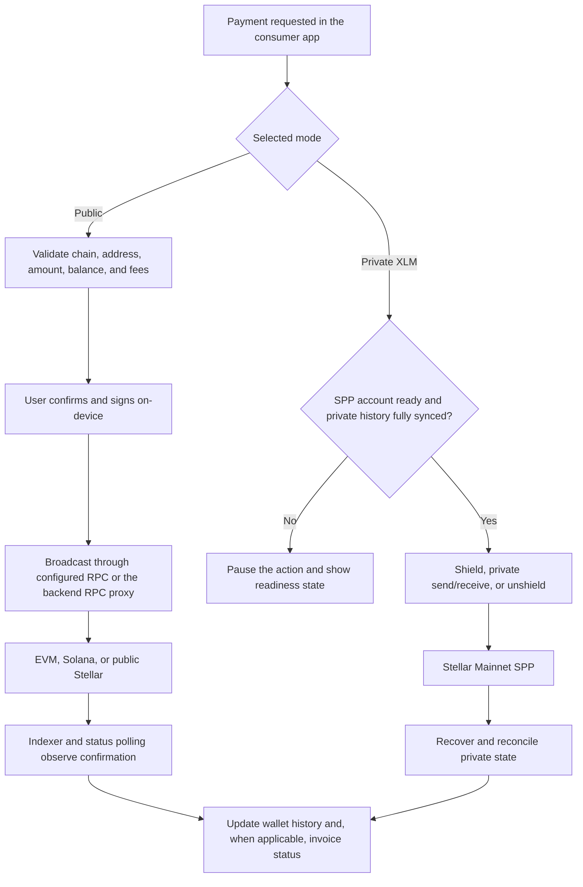
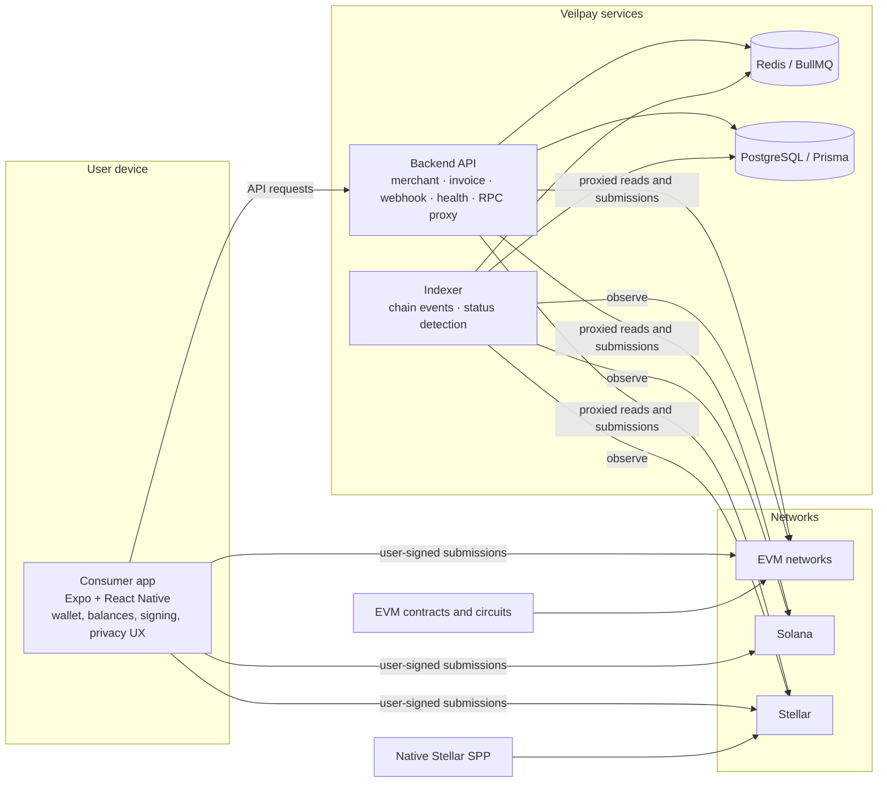

<div align="center">
  <h1>Veilpay</h1>
  <p><strong>Privacy-first, self-custody payments across EVM, Solana, and Stellar.</strong></p>
  <p>A mobile wallet and payment stack for holding, sending, receiving, and paying with digital assets with privacy as an explicit choice.</p>
  <p>
    <a href="docs/getting-started/quickstart.md">Quickstart</a> ·
    <a href="docs/getting-started/current-status.md">Current status</a> ·
    <a href="https://app.chroniclehq.com/share/08cdfd8b-39c3-4af4-ab0b-5fe773abee86/2c44d5e6-1111-4075-9299-82d00177b394/01fd3b7e-f79c-4f2a-8495-aa01d594c213">Product presentation</a> ·
    <a href="docs/architecture/system-architecture.md">Architecture</a> ·
    <a href="SECURITY.md">Security</a>
  </p>
  <p>
    <a href="https://expo.dev/"></a>
    <a href="https://www.typescriptlang.org/"></a>
    <a href="https://pnpm.io/"></a>
    
  </p>
</div>

> **Status.** Veilpay is in active development. Private XLM is generally available on Stellar Mainnet in supported Veilpay releases. Availability depends on the release configuration and native private-payment module; it is not an external-audit claim.

## What Veilpay provides

Veilpay is a self-custody payment wallet with supporting merchant and infrastructure services:

- A mobile wallet for balances, send and receive, transaction history, WalletConnect sessions, and fiat-ramp flows.
- Public payment flows across EVM networks, Solana, and Stellar.
- Privacy as an explicit mode: standard transfers, stealth-address and encrypted-note primitives, and Private XLM on Stellar Mainnet where the release supports it.
- A backend API for merchants, invoices, payments, webhooks, health checks, and selected RPC proxy operations.
- Background indexing and status detection so wallet and merchant state can reconcile with on-chain activity.

User signing material stays in wallet-controlled code paths on the device. Backend services provide infrastructure and integration boundaries; they do not receive the wallet mnemonic or private signing keys.

## Supported networks and privacy boundaries

| Family | Networks in the documented scope | Current privacy boundary |
| --- | --- | --- |
| EVM | Ethereum, Polygon, Arbitrum, Optimism, Base, BSC; Sepolia for testing | Public transfers plus stealth-address and encrypted-note primitives. Experimental privacy-pool components are not presented as production-live private settlement. |
| Solana | Solana Mainnet; Devnet for testing | Public wallet, balance, and send flows. Privacy-pool work remains a separate implementation track. |
| Stellar | Stellar Mainnet and Testnet | Public XLM flows. Private XLM supports shield, private send and receive, and unshield on Stellar Mainnet in supported releases. |

Private XLM actions require a ready account and complete private-history synchronization. If readiness cannot be verified, the app pauses the state-changing action. Shield and unshield transactions remain visible on Stellar Mainnet; private transfers reduce public transaction detail within the SPP system but do not remove every timing, device, network, or counterparty correlation risk.

## Status and trust boundaries

| Area | Status |
| --- | --- |
| Wallet, public payments, merchant API, and indexer | Implemented surfaces with network- and release-specific configuration. |
| Private XLM | Generally available on Stellar Mainnet in supported releases; requires a valid deployment configuration, native capability, and complete private-state synchronization. |
| Other privacy pools and chains | Experimental components and planned tracks are not presented as production-live private payments. Monero, Zcash, and Midnight remain roadmap work. |
| External audit status | Availability is separate from audit status. This README makes no claim of a completed external audit; see the documented security gates. |

## Payment flows

Public transfers are validated in the mobile app, confirmed and signed by the user on-device, submitted through a configured RPC path, and reconciled by chain status polling and indexing. Merchant payments add an invoice and signed webhook boundary: a merchant creates an invoice, the wallet pays it, the backend associates confirmed activity, and the merchant receives an idempotent webhook.

Private XLM follows a separate readiness path. The app verifies SPP account setup and current private state before allowing a shield, private send or receive, or unshield operation. Native proving and recovery support the private state; incomplete synchronization fails closed to a visible readiness state.



## Architecture



The repository’s authoritative runtime surfaces are:

| Surface | Path | Responsibility |
| --- | --- | --- |
| Consumer wallet | [`apps/consumer-app`](apps/consumer-app) | Wallet creation/import, SecureStore-backed state, balances, transactions, signing, and privacy UX |
| Merchant and wallet API | [`apps/backend`](apps/backend) | Merchant, invoice, payment, webhook, health, RPC proxy, and supporting queue boundaries |
| Chain indexer | [`apps/indexer`](apps/indexer) | Chain polling, event parsing, and transaction-status detection |

## Technology stack

| Layer | Technologies | Role |
| --- | --- | --- |
| Mobile | Expo, React Native, React, TypeScript, React Navigation, Zustand, Expo SecureStore | Self-custody wallet and user-facing payment flows |
| API and workers | Express, TypeScript, Prisma, PostgreSQL, Redis, BullMQ, Zod | Merchant/invoice/webhook APIs, health, RPC proxying, and asynchronous work |
| Chain integrations | viem/ethers for EVM, Solana Web3 and SPL tooling, Stellar SDK and SPP native bridge | Addressing, balances, submissions, and chain-specific operations |
| Privacy and contracts | Foundry/Solidity EVM packages, Circom/snarkjs circuits, Anchor/Solana programs, Rust SPP native module | Privacy primitives and chain-specific protocol components |

## Monorepo layout

```text
apps/
  consumer-app/      Expo React Native wallet (authoritative UI)
  backend/           Express API and workers (authoritative API)
  indexer/           Chain indexing and status detection

packages/
  shared/            Shared types and validation contracts
  contracts-evm/     EVM contracts and verifier tooling
  circuits/          Circom privacy circuits and test tooling
  contracts-solana/  Solana programs and Anchor tooling
  spp-native/        Rust native bridge for Stellar Private Payments
  vendor/spp/        Vendored SPP source (submodule)

docs/                Product, architecture, protocol, and security documentation
plans/               Roadmap and readiness plans
e2e/                 Cross-service end-to-end tests
```

## Local development

### Prerequisites

- Node.js 20+ (the repository’s `.nvmrc` pins 20.11.0)
- pnpm 9 (the repository’s `package.json#packageManager`)
- Docker and Docker Compose
- An Expo-compatible Android or iOS development setup for the mobile app

### Install and configure

```bash
pnpm install
git submodule update --init --recursive
cp .env.example .env
```

Fill in local values in `.env`; never commit real secrets, private keys, mnemonics, raw signatures, or provider credentials.

### Start infrastructure and prepare the database

```bash
pnpm db:up
pnpm --filter @veilpay/backend db:generate
pnpm --filter @veilpay/backend db:migrate
```

### Run the services

Run each process in its own terminal:

```bash
pnpm backend:dev
pnpm indexer:dev
pnpm consumer:dev
```

The local backend defaults to `http://localhost:3001`.

### Quality checks

```bash
pnpm lint
pnpm typecheck
pnpm test
pnpm build       # root build filters to backend and indexer
pnpm build:full  # build every workspace package
```

## Documentation

- **Getting started:** [Quickstart](docs/getting-started/quickstart.md), [what is Veilpay](docs/getting-started/what-is-veilpay.md), and [current status](docs/getting-started/current-status.md)
- **Architecture:** [system architecture](docs/architecture/system-architecture.md), [backend](docs/architecture/backend.md), [consumer app](docs/architecture/consumer-app.md), and [indexer and jobs](docs/architecture/indexer-and-jobs.md)
- **Protocol and payments:** [how Veilpay works](docs/protocol/how-veilpay-works.md), [privacy levels](docs/protocol/privacy-levels.md), [invoice lifecycle](docs/protocol/invoice-lifecycle.md), and [merchant API overview](docs/merchant-api/overview.md)
- **Privacy:** [privacy overview](docs/privacy/overview.md) and [Stellar Private Payments (SPP)](docs/privacy/stellar-spp.md)
- **Reference:** [supported networks](docs/chains/supported-networks.md) and [environment variables](docs/reference/environment-variables.md)
- **Security:** [security policy](SECURITY.md), [security model](docs/security/security-model.md), and [ceremony and audit gates](docs/security/ceremony-and-audit-gates.md)
- **Planning:** [product roadmap](plans/ROADMAP.md)

No completed external audit is claimed in this README. Audit scope, trusted-setup requirements, and release gates are tracked in the security documentation.
