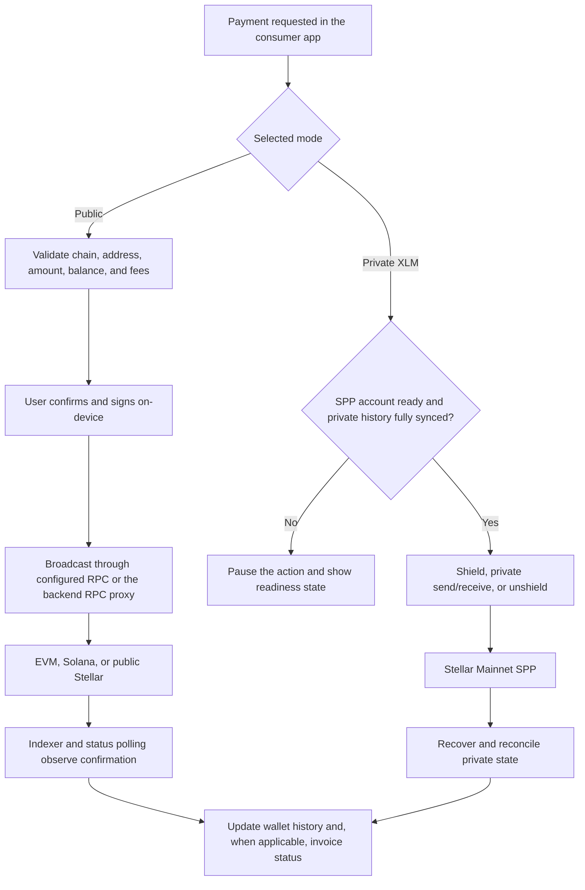
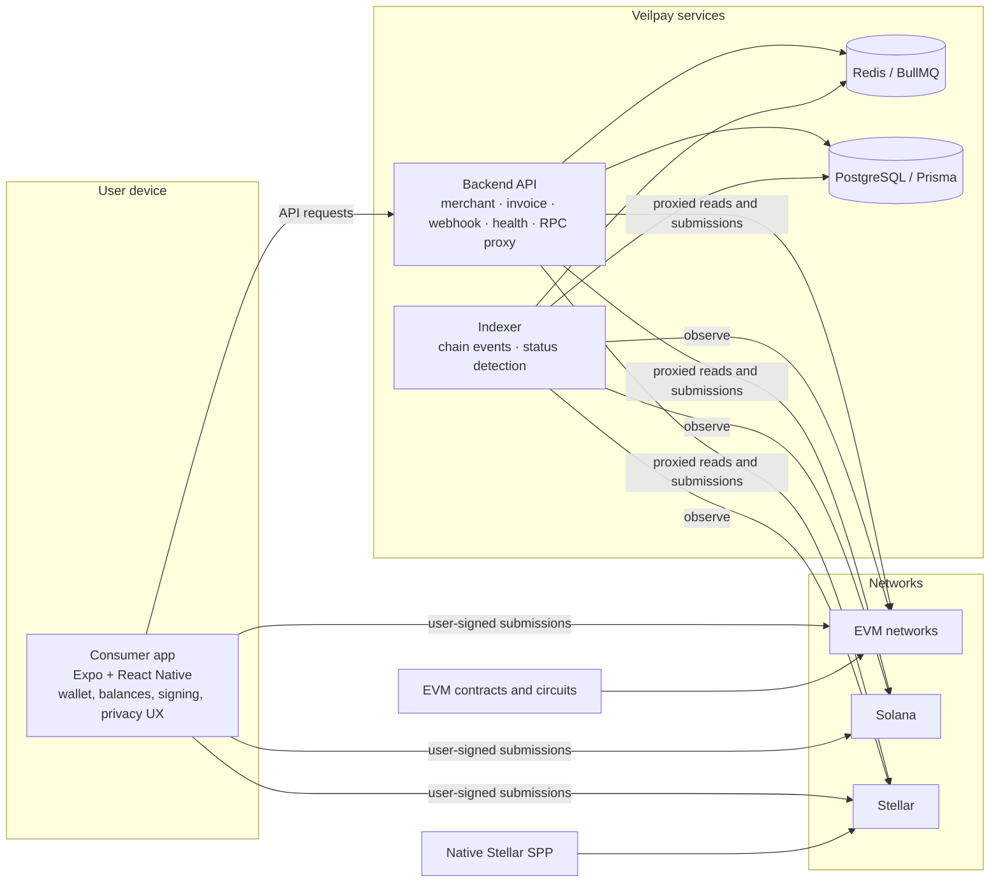

<div align="center">
  
  <h1>Veilpay</h1>
  <p><strong>The Multi-Privacy Payments Wallet</strong></p>
  <p>A next-generation mobile wallet and payment stack empowering users with privacy-first digital asset transactions across EVM, Solana, and Stellar.</p>
  <p>
    <a href="docs/getting-started/quickstart.md">Quickstart</a> ·
    <a href="docs/getting-started/current-status.md">Current Status</a> ·
    <a href="https://app.chroniclehq.com/share/08cdfd8b-39c3-4af4-ab0b-5fe773abee86/2c44d5e6-1111-4075-9299-82d00177b394/01fd3b7e-f79c-4f2a-8495-aa01d594c213">Presentation</a> ·
    <a href="docs/architecture/system-architecture.md">Architecture</a> ·
    <a href="SECURITY.md">Security</a>
  </p>
  <p>
    <a href="https://expo.dev/"></a>
    <a href="https://www.typescriptlang.org/"></a>
    <a href="https://pnpm.io/"></a>
    
  </p>
</div>

---

> **Note:** Veilpay is in active development. Private XLM is generally available on Stellar Mainnet in supported Veilpay releases. Availability depends on the release configuration and native private-payment module; it is not an external-audit claim.

## 🛡️ What is Veilpay?

**Veilpay** is a comprehensive **multi-privacy payments wallet** designed for the modern digital economy. It seamlessly integrates a mobile wallet interface with a robust backend to offer secure, private, and frictionless transactions. 

### Core Features
- **Multi-Privacy Wallet:** Public and private payment flows across EVM networks, Solana, and Stellar.
- **Privacy by Choice:** Utilize stealth-address and encrypted-note primitives, and experience Private XLM on Stellar Mainnet.
- **Merchant Ready:** Integrated backend API for invoices, webhooks, payments, health checks, and RPC proxy operations.
- **Seamless Syncing:** Background indexing and status detection for perfect reconciliation with on-chain activity.

*All user signing material remains securely on-device within wallet-controlled paths. Backend services facilitate infrastructure boundaries without ever accessing your mnemonic or private signing keys.*

## 🌐 Supported Networks & Privacy Boundaries

| Network Family | Supported Chains | Privacy Capabilities |
| :--- | :--- | :--- |
| **EVM** | Ethereum, Polygon, Arbitrum, Optimism, Base, BSC, Sepolia | Public transfers, stealth-address, encrypted-note primitives. *(Experimental privacy-pool components are in development)*. |
| **Solana** | Solana Mainnet, Devnet | Public wallet, balance, and send flows. *(Privacy-pool integration is a separate roadmap track)*. |
| **Stellar** | Stellar Mainnet, Testnet | Public XLM flows. **Private XLM** supports shielding, private send/receive, and unshielding on Stellar Mainnet. |

> **Important:** Private XLM actions require complete private-history synchronization. If readiness cannot be verified, the app pauses state-changing actions to protect your privacy. While private transfers reduce public transaction details, they do not eliminate all correlation risks.

## 📊 Status & Trust Boundaries

| Component Area | Current Status |
| :--- | :--- |
| **Wallet & Public Payments** | Live and implemented surfaces with network- and release-specific configurations. |
| **Merchant API & Indexer** | Fully functional backend supporting infrastructure boundaries. |
| **Private XLM** | Generally available on Stellar Mainnet in supported releases. Requires native capabilities and state synchronization. |
| **Other Privacy Pools** | Experimental features and roadmapped integrations (e.g., Monero, Zcash, Midnight). Not yet intended for production. |
| **External Audit** | Pending. Availability does not imply a completed external audit. Refer to our documented security gates. |

## 💸 Payment Flows Architecture

Veilpay utilizes a dual-path execution model to ensure both public transparency and robust private transactions.

### Public Transfers
Validated in the app -> User confirms/signs on-device -> Broadcast via configured RPC -> On-chain confirmation -> Indexer polls status.

### Merchant Payments
Merchant creates invoice -> Wallet pays invoice -> Backend verifies -> Merchant receives idempotent webhook.

### Private XLM Transactions
The app verifies SPP account setup and private state before allowing any shielding or private transfers. Native proving supports this private state, failing securely to a readiness screen if incomplete.

<details>
<summary>View Payment Flow Diagram</summary>


</details>

## 🏗️ System Architecture

<details>
<summary>View Architecture Diagram</summary>


</details>

### Authoritative Runtime Surfaces

| Surface | Path | Primary Responsibility |
| :--- | :--- | :--- |
| **Consumer Wallet** | [`apps/consumer-app`](apps/consumer-app) | SecureStore state, balances, transactions, signing, and privacy UX |
| **Backend API** | [`apps/backend`](apps/backend) | Merchant processing, invoice webhooks, RPC proxying |
| **Chain Indexer** | [`apps/indexer`](apps/indexer) | Chain event polling, parsing, and state detection |

## 🛠️ Technology Stack

| Layer | Technologies |
| :--- | :--- |
| **Mobile** | Expo, React Native, React, TypeScript, React Navigation, Zustand, Expo SecureStore |
| **API & Workers** | Express, TypeScript, Prisma, PostgreSQL, Redis, BullMQ, Zod |
| **Chain Integrations**| viem/ethers (EVM), Solana Web3/SPL tooling, Stellar SDK & SPP native bridge |
| **Privacy & Contracts**| Foundry/Solidity, Circom/snarkjs, Anchor/Solana, Rust SPP native module |

## 📁 Monorepo Layout

```text
apps/
  ├── consumer-app/      # Expo React Native wallet (authoritative UI)
  ├── backend/           # Express API and workers (authoritative API)
  └── indexer/           # Chain indexing and status detection

packages/
  ├── shared/            # Shared types and validation contracts
  ├── contracts-evm/     # EVM contracts and verifier tooling
  ├── circuits/          # Circom privacy circuits and test tooling
  ├── contracts-solana/  # Solana programs and Anchor tooling
  ├── spp-native/        # Rust native bridge for Stellar Private Payments
  └── vendor/spp/        # Vendored SPP source (submodule)

docs/                    # Product, architecture, protocol, and security docs
plans/                   # Roadmap and readiness plans
e2e/                     # Cross-service end-to-end tests
```

## 🚀 Local Development

### Prerequisites
- **Node.js** 20+ (Pinned to 20.11.0 in `.nvmrc`)
- **pnpm** 9
- **Docker** & **Docker Compose**
- Expo-compatible Android or iOS development setup

### 1. Install & Configure

```bash
pnpm install
git submodule update --init --recursive
cp .env.example .env
```

*Ensure you fill in your `.env` correctly. **Never commit real secrets, keys, or mnemonics.***

### 2. Prepare Infrastructure

```bash
pnpm db:up
pnpm --filter @veilpay/backend db:generate
pnpm --filter @veilpay/backend db:migrate
```

### 3. Run the Services

Open separate terminal windows and run:

```bash
pnpm backend:dev
pnpm indexer:dev
pnpm consumer:dev
```
*(The local backend defaults to `http://localhost:3001`)*

### 4. Quality Checks

```bash
pnpm lint
pnpm typecheck
pnpm test
pnpm build       # Builds backend and indexer
pnpm build:full  # Builds every workspace package
```

## 📚 Documentation Reference

- **Getting Started:** [Quickstart](docs/getting-started/quickstart.md) | [What is Veilpay?](docs/getting-started/what-is-veilpay.md) | [Current Status](docs/getting-started/current-status.md)
- **Architecture:** [System Overview](docs/architecture/system-architecture.md) | [Backend](docs/architecture/backend.md) | [Consumer App](docs/architecture/consumer-app.md) | [Indexer](docs/architecture/indexer-and-jobs.md)
- **Protocol:** [How it Works](docs/protocol/how-veilpay-works.md) | [Privacy Levels](docs/protocol/privacy-levels.md) | [Invoice Lifecycle](docs/protocol/invoice-lifecycle.md) | [Merchant API](docs/merchant-api/overview.md)
- **Privacy:** [Overview](docs/privacy/overview.md) | [Stellar SPP](docs/privacy/stellar-spp.md)
- **Reference:** [Supported Networks](docs/chains/supported-networks.md) | [Environment Variables](docs/reference/environment-variables.md)
- **Security:** [Security Policy](SECURITY.md) | [Security Model](docs/security/security-model.md) | [Audit Gates](docs/security/ceremony-and-audit-gates.md)
---
*No completed external audit is claimed in this README. Audit scope, trusted-setup requirements, and release gates are tracked in the security documentation.*
