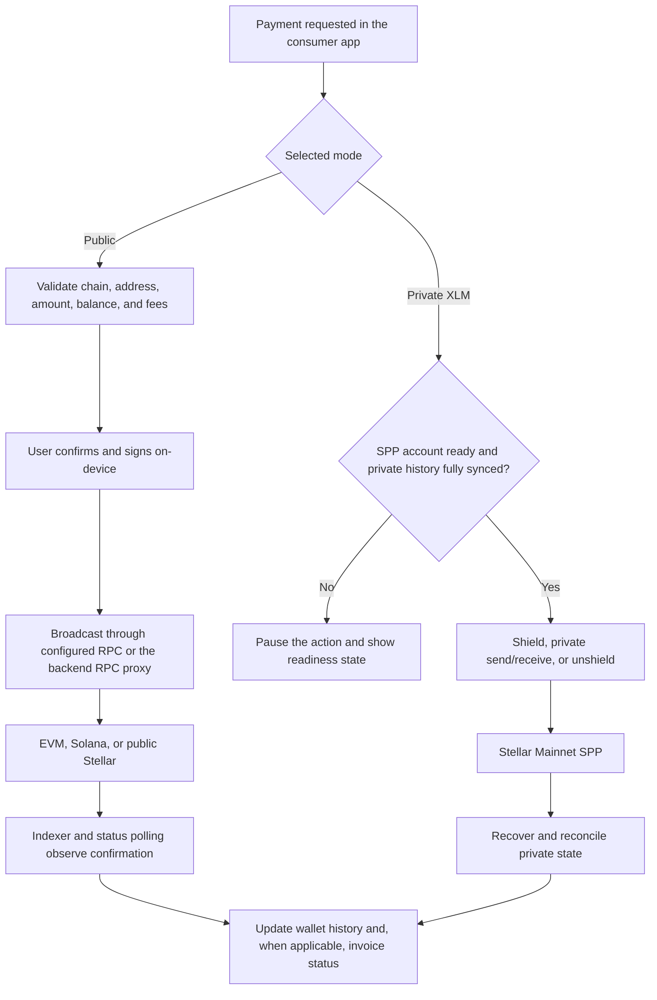
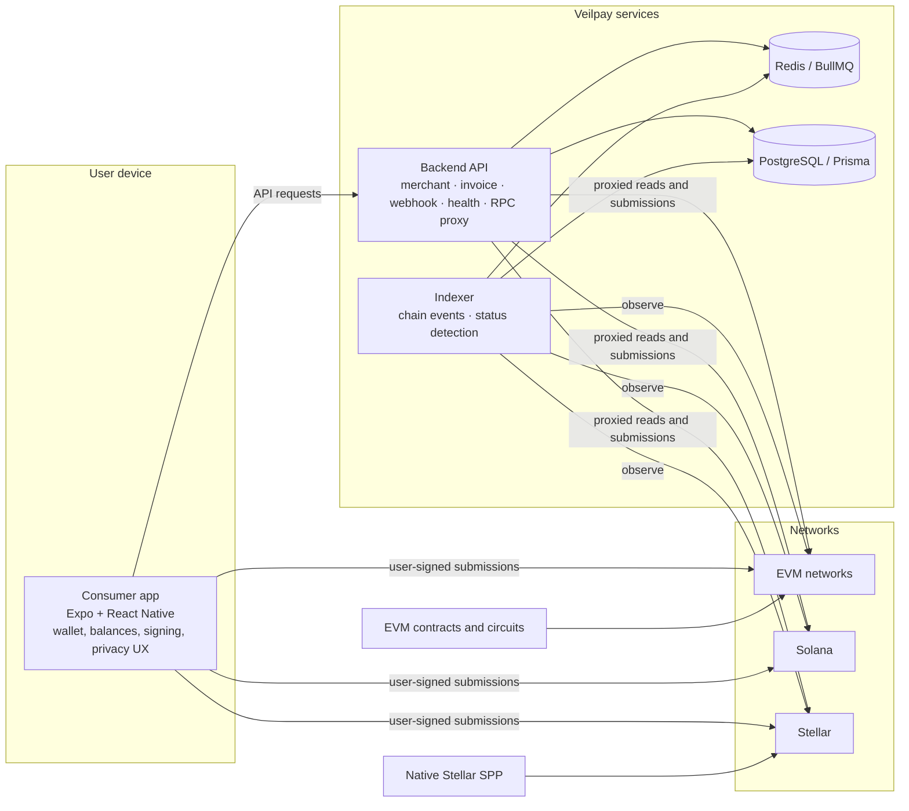

<div align="center">
  
  <h1>Veilpay</h1>
  <p><strong>The Multi-Privacy Payments Wallet</strong></p>
  <p>A next-generation mobile wallet and payment stack empowering users with privacy-first digital asset transactions across EVM, Solana, and Stellar.</p>
  <p>
    <a href="docs/getting-started/quickstart.md">Quickstart</a> ·
    <a href="docs/getting-started/current-status.md">Current Status</a> ·
    <a href="https://app.chroniclehq.com/share/08cdfd8b-39c3-4af4-ab0b-5fe773abee86/2c44d5e6-1111-4075-9299-82d00177b394/01fd3b7e-f79c-4f2a-8495-aa01d594c213">Presentation</a> ·
    <a href="docs/architecture/system-architecture.md">Architecture</a> ·
    <a href="SECURITY.md">Security</a>
  </p>
  <p>
    <a href="https://expo.dev/"></a>
    <a href="https://www.typescriptlang.org/"></a>
    <a href="https://pnpm.io/"></a>
    
  </p>
</div>

---

> **Note:** Veilpay is in active development. Private XLM is generally available on Stellar Mainnet in supported Veilpay releases. Availability depends on the release configuration and native private-payment module; it is not an external-audit claim.

## 🛡️ What is Veilpay?

**Veilpay** is a comprehensive **multi-privacy payments wallet** designed for the modern digital economy. It seamlessly integrates a mobile wallet interface with a robust backend to offer secure, private, and frictionless transactions. 

### Core Features
- **Multi-Privacy Wallet:** Public and private payment flows across EVM networks, Solana, and Stellar.
- **Privacy by Choice:** Utilize stealth-address and encrypted-note primitives, and experience Private XLM on Stellar Mainnet.
- **Merchant Ready:** Integrated backend API for invoices, webhooks, payments, health checks, and RPC proxy operations.
- **Seamless Syncing:** Background indexing and status detection for perfect reconciliation with on-chain activity.

*All user signing material remains securely on-device within wallet-controlled paths. Backend services facilitate infrastructure boundaries without ever accessing your mnemonic or private signing keys.*

## 🌐 Supported Networks & Privacy Boundaries

| Network Family | Supported Chains | Privacy Capabilities |
| :--- | :--- | :--- |
| **EVM** | Ethereum, Polygon, Arbitrum, Base, BSC, Sepolia | Public transfers, stealth-address, encrypted-note primitives. *(Experimental privacy-pool components are in development)*. |
| **Solana** | Solana Mainnet, Devnet | Public wallet, balance, and send flows. *(Privacy-pool integration is a separate roadmap track)*. |
| **Stellar** | Stellar Mainnet, Testnet | Public XLM flows. **Private XLM** supports shielding, private send/receive, and unshielding on Stellar Mainnet. |

> **Important:** Private XLM actions require complete private-history synchronization. If readiness cannot be verified, the app pauses state-changing actions to protect your privacy. While private transfers reduce public transaction details, they do not eliminate all correlation risks.

## 📊 Status & Trust Boundaries

| Component Area | Current Status |
| :--- | :--- |
| **Wallet & Public Payments** | Live and implemented surfaces with network- and release-specific configurations. |
| **Merchant API & Indexer** | Fully functional backend supporting infrastructure boundaries. |
| **Private XLM** | Generally available on Stellar Mainnet in supported releases. Requires native capabilities and state synchronization. |
| **Other Privacy Pools** | Experimental features and roadmapped integrations (e.g., Monero, Zcash, Midnight). Not yet intended for production. |
| **External Audit** | Pending. Availability does not imply a completed external audit. Refer to our documented security gates. |

## 💸 Payment Flows Architecture

Veilpay utilizes a dual-path execution model to ensure both public transparency and robust private transactions.

### Public Transfers
Validated in the app -> User confirms/signs on-device -> Broadcast via configured RPC -> On-chain confirmation -> Indexer polls status.

### Merchant Payments
Merchant creates invoice -> Wallet pays invoice -> Backend verifies -> Merchant receives idempotent webhook.

### Private XLM Transactions
The app verifies SPP account setup and private state before allowing any shielding or private transfers. Native proving supports this private state, failing securely to a readiness screen if incomplete.

<details>
<summary>View Payment Flow Diagram</summary>


```mermaid
flowchart TD
  Start["Payment requested in the consumer app"] --> Mode{"Selected mode"}
  Mode -->|Public| Validate["Validate chain, address, amount, balance, and fees"]
  Validate --> Sign["User confirms and signs on-device"]
  Sign --> Submit["Broadcast through configured RPC or the backend RPC proxy"]
  Submit --> PublicChain["EVM, Solana, or public Stellar"]
  PublicChain --> Confirm["Indexer and status polling observe confirmation"]
  Mode -->|Private XLM| Ready{"SPP account ready and private history fully synced?"}
  Ready -->|No| Pause["Pause the action and show readiness state"]
  Ready -->|Yes| PrivateOp["Shield, private send/receive, or unshield"]
  PrivateOp --> Stellar["Stellar Mainnet SPP"]
  Stellar --> Reconcile["Recover and reconcile private state"]
  Confirm --> Outcome["Update wallet history and, when applicable, invoice status"]
  Reconcile --> Outcome
```
</details>

## 🏗️ System Architecture

<details>
<summary>View Architecture Diagram</summary>


```mermaid
flowchart LR
  subgraph Client["User device"]
    Wallet["Consumer app<br/>Expo + React Native<br/>wallet, balances, signing, privacy UX"]
  end

  subgraph Services["Veilpay services"]
    API["Backend API<br/>merchant · invoice · webhook · health · RPC proxy"]
    Indexer["Indexer<br/>chain events · status detection"]
    Queue[(Redis / BullMQ)]
    DB[(PostgreSQL / Prisma)]
  end

  subgraph Networks["Networks"]
    EVM["EVM networks"]
    SOL["Solana"]
    XLM["Stellar"]
  end

  Wallet -->|API requests| API
  Wallet -->|user-signed submissions| EVM
  Wallet -->|user-signed submissions| SOL
  Wallet -->|user-signed submissions| XLM
  API --> DB
  API --> Queue
  API -->|proxied reads and submissions| EVM
  API -->|proxied reads and submissions| SOL
  API -->|proxied reads and submissions| XLM
  Indexer --> DB
  Indexer --> Queue
  Indexer -->|observe| EVM
  Indexer -->|observe| SOL
  Indexer -->|observe| XLM
  EvmPrivacy["EVM contracts and circuits"] --> EVM
  StellarPrivacy["Native Stellar SPP"] --> XLM
```
</details>

### Authoritative Runtime Surfaces

| Surface | Path | Primary Responsibility |
| :--- | :--- | :--- |
| **Consumer Wallet** | [`apps/consumer-app`](apps/consumer-app) | SecureStore state, balances, transactions, signing, and privacy UX |
| **Backend API** | [`apps/backend`](apps/backend) | Merchant processing, invoice webhooks, RPC proxying |
| **Chain Indexer** | [`apps/indexer`](apps/indexer) | Chain event polling, parsing, and state detection |

## 🛠️ Technology Stack

| Layer | Technologies |
| :--- | :--- |
| **Mobile** | Expo, React Native, React, TypeScript, React Navigation, Zustand, Expo SecureStore |
| **API & Workers** | Express, TypeScript, Prisma, PostgreSQL, Redis, BullMQ, Zod |
| **Chain Integrations**| viem/ethers (EVM), Solana Web3/SPL tooling, Stellar SDK & SPP native bridge |
| **Privacy & Contracts**| Foundry/Solidity, Circom/snarkjs, Anchor/Solana, Rust SPP native module |

## 📁 Monorepo Layout

```text
config/                  # Root configuration files (tsconfig, turbo, prettier, eslint, etc.)
infra/                   # Infrastructure as code and deployment configurations

apps/
  ├── consumer-app/      # Expo React Native wallet (authoritative UI)
  ├── backend/           # Express API and workers (authoritative API)
  └── indexer/           # Chain indexing and status detection

packages/
  ├── shared/            # Shared types and validation contracts
  ├── contracts-evm/     # EVM contracts and verifier tooling
  ├── circuits/          # Circom privacy circuits and test tooling
  ├── contracts-solana/  # Solana programs and Anchor tooling
  ├── spp-native/        # Rust native bridge for Stellar Private Payments
  ├── auditor/           # Security auditing and verification tooling
  └── vendor/            # Vendored dependencies (submodules)

docs/                    # Product, architecture, protocol, and security documentation
plans/                   # Roadmap and readiness plans
e2e/                     # Cross-service end-to-end tests
```

## 🚀 Local Development

### Prerequisites
- **Node.js** 24 (pinned in `.nvmrc`)
- **pnpm** 9 — the only supported package manager in this workspace; do not run `npm install` or `yarn` here
- **Docker** & **Docker Compose** (PostgreSQL + Redis backing services)
- Expo-compatible Android or iOS development setup

### 1. Install & Configure

```bash
pnpm install
git submodule update --init --recursive
```

The environment reference is [`/.env.example`](.env.example) at the repository root — it covers backend and consumer-app variables in one file. Copy it to the target locations and fill in local values:

```bash
cp .env.example apps/backend/.env
cp .env.example apps/consumer-app/.env.local   # only EXPO_PUBLIC_* vars are bundled
```

*Ensure you fill in your env files correctly. **Never commit real secrets, keys, or mnemonics.***

#### Key environment variables

| Variable | Service | Notes |
| :--- | :--- | :--- |
| `DATABASE_URL` | backend | PostgreSQL connection string |
| `DIRECT_URL` | backend | Direct (non-pooled) postgres URL; required by `apps/backend/prisma/schema.prisma` (`directUrl`) so `prisma migrate` never runs through a pooler |
| `SENTRY_DSN` | backend **and** indexer | **Required in production** — both services fail closed at boot when it is empty |
| `WEBHOOK_SIGNING_SECRET` | backend | Required, min 32 chars, distinct from `JWT_SECRET`; there is no development default (the known dev value is rejected at boot) |
| `TRUST_PROXY_HOPS` | backend | Number of trusted reverse-proxy hops in front of the API; set to your load-balancer depth |
| `JWT_SECRET` / `API_KEY_SALT` | backend | Required secrets (min 32 / min 16 chars) |
| `ALCHEMY_API_KEY` / `INFURA_API_KEY` | backend | At least one is required in production (boot fails closed) |
| `RELAYER_SHARED_SECRET` | backend | Required in production for the relayer withdraw path |

The authoritative, always-current variable list is [`/.env.example`](.env.example); see also [Environment Variables](docs/reference/environment-variables.md).

### 2. Prepare Infrastructure

The local Docker Compose stack (PostgreSQL 16 + Redis 7) is defined in [`config/docker-compose.yml`](config/docker-compose.yml):

```bash
docker compose -f config/docker-compose.yml up -d
```

*(Requires a running Docker host. The root convenience script `pnpm db:up` runs plain `docker-compose up -d` from the repo root, where no compose file lives after the repo reorganization — prefer the explicit `-f` form above.)*

### 3. Prepare the Database

```bash
pnpm --filter @veilpay/backend db:generate   # prisma generate (Prisma client)
pnpm --filter @veilpay/backend db:migrate    # prisma migrate dev — LOCAL DEV ONLY
```

For production or CI, apply only the committed migrations:

```bash
pnpm --filter @veilpay/backend db:deploy     # prisma migrate deploy
```

> ⚠️ **Never run `prisma migrate dev` or `prisma db push` against a production database.** They can create uncommitted migration state and schema drift. Production uses `prisma migrate deploy` exclusively, applying the migrations committed under `apps/backend/prisma/migrations`.

### 4. Stage Circuit Prover Assets (before ANY consumer-app bundle build)

```bash
node apps/consumer-app/scripts/stage-circuit-assets.js
```

This stages the withdraw-circuit prover artifacts (`withdraw.wasm`, `withdraw_final.zkey`, `snarkjs.min.js`) into `apps/consumer-app/assets/circuits/` — a gitignored directory, so **fresh clones start with none of these binaries** — and verifies every staged byte against the SHA-256 pins baked in [`apps/consumer-app/src/constants/circuit.ts`](apps/consumer-app/src/constants/circuit.ts). The script fails closed on any digest mismatch.

- **Release builds:** the prover loads from these bundled local files with no remote fallback, and the integrity pins are **mandatory** — a build with missing/mismatched assets fails closed.
- **Dev builds:** remote artifact URLs remain available and pinning is relaxed, but Metro still requires the staged assets to bundle.
- `--offline` skips the network entirely (fails if no digest-valid local copy exists).

**No local circuit build? Supply the binaries from a pinned source** (nothing ~10MB-ish is committed to git):

```bash
CIRCUIT_ARTIFACTS_URL=<url-or-dir> node apps/consumer-app/scripts/supply-circuit-assets.js
# or: pnpm --filter consumer-app circuits:supply
```

`CIRCUIT_ARTIFACTS_URL` is either an **https base URL** — e.g. the download base of a GitHub release, `https://github.com/<owner>/<repo>/releases/download/<tag>`, with assets named `withdraw.wasm`, `withdraw_final.zkey`, `snarkjs.min.js` — or a **local directory** containing them. The script verifies every fetched byte against the same baked pins **before anything is staged**, then hands off to the staging script above (which re-verifies at write time; the CDN is not used). An unset source, an unreachable source, or any digest mismatch exits 1 and stages nothing. CI (`.github/workflows/android-build.yml`) resolves sources in exactly this order: local `packages/circuits/build` outputs when present, else the supply script fed by the `CIRCUIT_ARTIFACTS_URL` GitHub repository variable — and fails closed when neither works.

**One-time setup for fresh runners (the only user action):** upload the three binaries to a GitHub release — or any other pinned https source — and set the repository *variable* `CIRCUIT_ARTIFACTS_URL` to its download base URL (GitHub → Settings → Secrets and variables → Actions → Variables). The pins in [`circuit.ts`](apps/consumer-app/src/constants/circuit.ts), not the URL, guarantee the bytes. Full details: [Circuit asset supply and pinning](docs/reference/circuit-asset-supply.md).

### 5. Run the Services

Open separate terminal windows and run:

```bash
pnpm backend:dev
pnpm indexer:dev
pnpm consumer:dev
```
*(The local backend defaults to `http://localhost:3001`)*

### 6. Quality Checks

```bash
pnpm lint
pnpm typecheck
pnpm test
pnpm build       # Builds backend and indexer
pnpm build:full  # Builds every workspace package
```

Per-workspace checks:

```bash
pnpm --filter @veilpay/backend typecheck
pnpm --filter @veilpay/backend test
pnpm --filter @veilpay/indexer typecheck
pnpm --filter @veilpay/indexer test
pnpm --filter consumer-app typecheck
pnpm --filter consumer-app test
```

Release hygiene (both are read-only checks):

```bash
node apps/consumer-app/scripts/check-version-sync.js   # app version / build number vs changelog
node scripts/validate-maestro-flows.mjs                # e2e Maestro flow + testID coverage
```

## 🔌 Merchant API Essentials

### API-key rotation

A leaked merchant API key is a **self-service fix**: rotate it and the old key stops authorizing immediately (401 on first use), while the rotated key is returned to you **exactly once** — copy it to your secret manager at rotation time; VeilPay never shows it again.

```http
POST /api/v1/merchant/keys/rotate
```

Authenticated with the current merchant key (the same `x-api-key` + signature
headers as every authenticated endpoint). After rotation, replace the stored key
immediately: the endpoint response is the only place the new key ever appears.

- **200** → `{"merchantId": "<uuid>", "apiKey": "vp_…", "warning": "Store this API key now — it is shown exactly once and never again."}`
- **409** → `{"error": "API key conflict: the key was already rotated. Re-authenticate with the current key and retry.", "code": "API_KEY_ROTATION_CONFLICT"}` — a concurrent rotation won the compare-and-swap; no key material is returned. Re-authenticate with the current key and retry.
- The old key stops authorizing **immediately** (401 at the auth middleware on first use after rotation).

### Webhook signature verification

Every merchant webhook is signed with HMAC-SHA256 over `${timestamp}.${rawBody}` — using the **merchant's per-merchant signing secret** if one is set, otherwise the global `WEBHOOK_SIGNING_SECRET` — and sent with two headers:

| Header | Content |
| :--- | :--- |
| `X-VeilPay-Signature` | hex-encoded HMAC-SHA256 digest |
| `X-VeilPay-Timestamp` | Unix timestamp in milliseconds |

Verification rules (all enforced server-side at `apps/backend/src/controllers/webhookController.ts`):
- Read the **raw request body** (exact bytes received — do not re-serialize parsed JSON).
- Recompute HMAC-SHA256 over `` `${timestamp}.${rawBody}` `` and compare in constant time.
- Reject timestamps outside the **5-minute** window.

Minimal Node.js recipe:

```js
const crypto = require('crypto');

const expected = crypto
  .createHmac('sha256', process.env.WEBHOOK_SIGNING_SECRET)
  .update(`${timestampHeader}.${rawBody}`) // rawBody = exact bytes received
  .digest('hex');

const ok =
  expected.length === signatureHeader.length &&
  crypto.timingSafeEqual(
    Buffer.from(expected, 'hex'),
    Buffer.from(signatureHeader, 'hex'),
  );
```

You can validate your verifier against the backend's own endpoint — `POST /api/v1/webhook/verify` (rate-limited to resist signature probing; accepts a `merchantId` query parameter or a `merchantId` field in the verified body to check against that merchant's per-merchant secret) checks a signature/timestamp/body triple and returns `{"verified": true}` on match. Deeper guidance: [Webhook security](docs/security/webhook-security.md) · [Webhooks](docs/merchant-api/webhooks.md).

**Both services sign identically.** The indexer signs its merchant webhooks with exactly the scheme above (aligned in round 4): bare-hex `X-VeilPay-Signature` = HMAC-SHA256 over `${timestamp}.${rawBody}` plus `X-VeilPay-Timestamp`, keyed by the merchant's per-merchant secret when set, else the global secret. Receivers that previously verified the indexer's old `sha256=`-prefixed body-only signature must switch to the shared scheme above — one verifier now covers backend and indexer webhooks.

## 📚 Documentation Reference

- **Getting Started:** [Quickstart](docs/getting-started/quickstart.md) | [What is Veilpay?](docs/getting-started/what-is-veilpay.md) | [Current Status](docs/getting-started/current-status.md)
- **Architecture:** [System Overview](docs/architecture/system-architecture.md) | [Backend](docs/architecture/backend.md) | [Consumer App](docs/architecture/consumer-app.md) | [Indexer](docs/architecture/indexer-and-jobs.md)
- **Protocol:** [How it Works](docs/protocol/how-veilpay-works.md) | [Privacy Levels](docs/protocol/privacy-levels.md) | [Invoice Lifecycle](docs/protocol/invoice-lifecycle.md) | [Merchant API](docs/merchant-api/overview.md)
- **Privacy:** [Overview](docs/privacy/overview.md) | [Stellar SPP](docs/privacy/stellar-spp.md)
- **Reference:** [Supported Networks](docs/chains/supported-networks.md) | [Environment Variables](docs/reference/environment-variables.md) | [Settlement Reconciliation Runbook](docs/reference/settlement-reconciliation.md)
- **Security:** [Security Policy](SECURITY.md) | [Security Model](docs/security/security-model.md) | [Audit Gates](docs/security/ceremony-and-audit-gates.md) | [Doppler Rotation Runbook](docs/security/doppler-rotation-and-history-purge.md)
---
*No completed external audit is claimed in this README. Audit scope, trusted-setup requirements, and release gates are tracked in the security documentation.*
