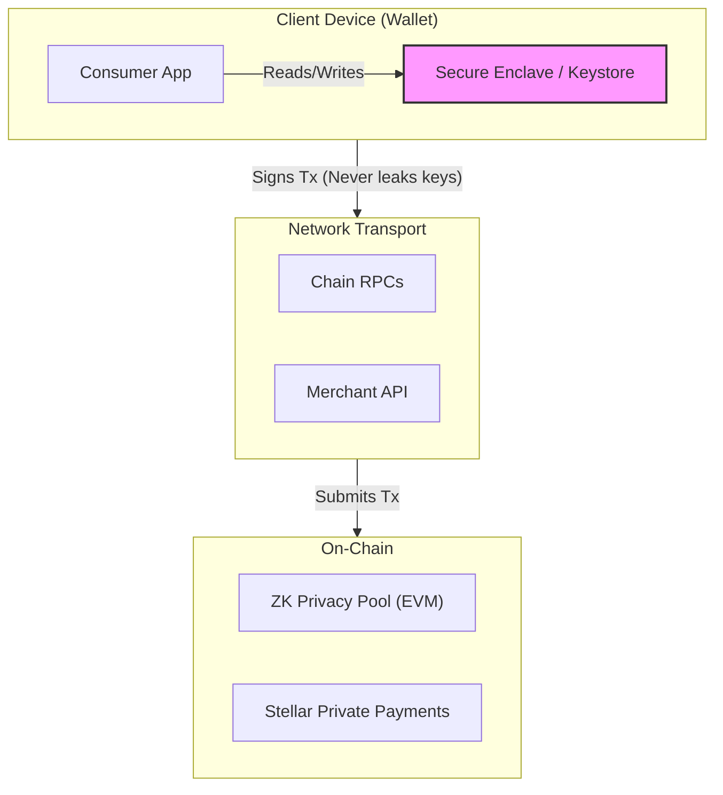
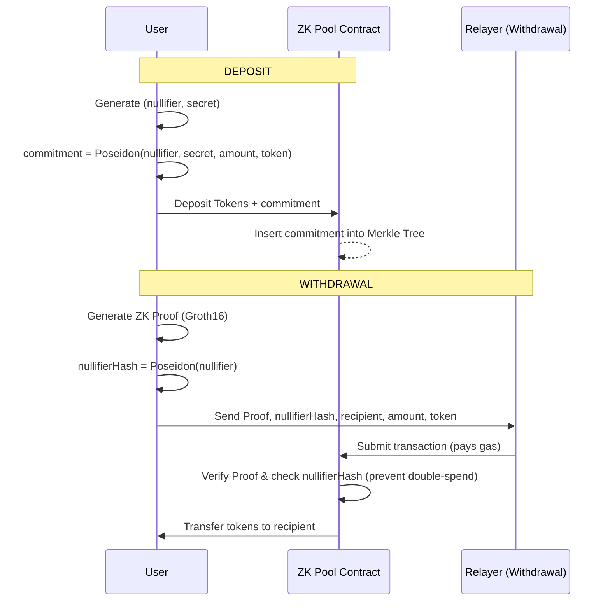

# 🛡️ Veilpay Security

> [!NOTE]
> **Status:** Active development · Last updated: 2026-10-02  
> **External audits:** Pending (see [Ceremony & audit gates](docs/security/ceremony-and-audit-gates.md))

This document is the **security policy and threat overview** for the monorepo. Deeper product checklists live under [`docs/security/`](docs/security/).

---

## 🚨 1. Reporting Vulnerabilities

> [!IMPORTANT]
> Do **not** open a public GitHub issue for security bugs.

1. **Email:** `veilpay@proton.me`
2. **Subject:** `[SECURITY] <short title>`
3. **Include:** description, repro steps, impact, and a suggested fix if you have one.

We aim to acknowledge within **48 hours** and coordinate disclosure.

---

## 🛑 2. What Must Never Be Committed or Logged

> [!CAUTION]
> The following must never be pushed to version control or printed in application logs:

- ❌ Mnemonics, private keys, raw signatures, session secrets
- ❌ `.env` files with real credentials (use `.env.example` only)
- ❌ Production Groth16 toxic waste / contributor randomness
- ❌ User nullifier / secret note preimages

*App and agent rules: never print or persist secrets. See `apps/consumer-app` SecureStore usage for commitment notes.*

---

## 🎯 3. Threat Model (Summary)

The Veilpay ecosystem spans across client devices, backend APIs, and on-chain privacy pools. Below is a high-level overview of our threat model and mitigations.

<details>
<summary>View Trust Boundaries Diagram</summary>


```mermaid
flowchart TD
  subgraph Client ["Client Device (Wallet)"]
    App["Consumer App"]
    SecureStore["Secure Enclave / Keystore"]
    App -->|Reads/Writes| SecureStore
  end

  subgraph Network ["Network Transport"]
    RPC["Chain RPCs"]
    API["Merchant API"]
  end

  subgraph Chains ["On-Chain"]
    ZkPool["ZK Privacy Pool (EVM)"]
    SPP["Stellar Private Payments"]
  end

  Client -- "Signs Tx (Never leaks keys)" --> Network
  Network -- "Submits Tx" --> Chains
  
  style SecureStore fill:#f9f,stroke:#333,stroke-width:2px
```
</details>

### 📱 3.1 Client / Wallet

| Threat | Impact | Mitigations |
| :--- | :--- | :--- |
| **Phishing / Fake App** | Critical | Store listing, deep-link allowlists, URL checks |
| **Device Compromise** | Critical | SecureStore / Keychain, biometrics, `FLAG_SECURE` where available |
| **Clipboard / Screen Capture** | Critical | Anti-screenshot on sensitive screens, no seed in logs |
| **Malicious RPC** | High | Operator-pinned RPCs in production; validate chain IDs |

### 🔌 3.2 Backend / Merchant API

| Threat | Impact | Mitigations |
| :--- | :--- | :--- |
| **API Key Abuse** | High | Hashed keys, rate limits, auth middleware, self-service key rotation (see 3.5) |
| **Webhook Forgery** | High | HMAC-SHA256 signature + timestamp window ([webhook security](docs/security/webhook-security.md)) |
| **Relayer Drain / Wrong Pool**| High | Contract allowlist; relayer never learns nullifier/secret |
| **Injection / SSRF** | High | Zod validation, URL safety helpers; SSRF guard on indexer webhook delivery (see 3.5) |
| **Redis Outage Blinding Limiter** | High | Bounded Redis failover with in-process degradation (see 3.5) |

### 🔐 3.3 Privacy Pool (EVM ZK)

Our zero-knowledge architecture ensures that deposits and withdrawals cannot be linked, while maintaining mathematical certainty that funds are not double-spent or forged.

<details>
<summary>View ZK Flow Diagram</summary>


```mermaid
sequenceDiagram
    participant User as User
    participant Pool as ZK Pool Contract
    participant Relayer as Relayer (Withdrawal)

    Note over User,Pool: DEPOSIT
    User->>User: Generate (nullifier, secret)
    User->>User: commitment = Poseidon(nullifier, secret, amount, token)
    User->>Pool: Deposit Tokens + commitment
    Pool-->>Pool: Insert commitment into Merkle Tree
    
    Note over User,Relayer: WITHDRAWAL
    User->>User: Generate ZK Proof (Groth16)
    User->>User: nullifierHash = Poseidon(nullifier)
    User->>Relayer: Send Proof, nullifierHash, recipient, amount, token
    Relayer->>Pool: Submit transaction (pays gas)
    Pool->>Pool: Verify Proof & check nullifierHash (prevent double-spend)
    Pool->>User: Transfer tokens to recipient
```
</details>

| Threat | Impact | Mitigations |
| :--- | :--- | :--- |
| **Overstated Withdraw** | Critical | Note binds `amount` + `token`. Deposit circuit proves leaf opens to transferred value |
| **Double-Spend** | Critical | `nullifierSpent` mapping; `nullifierHash = Poseidon(nullifier)` |
| **Public-Input Congruence** | High | Pool rejects any public input ≥ BN254 scalar field `r` |
| **Forged Groth16 Proofs** | Critical | **Requires real multi-party ceremony** — current keys are **dev-only** |
| **Stolen Note** | High | Device security; any holder can set recipient (by design) |
| **Malicious ERC-20** | Medium | Prefer allowlisted tokens; fee-on-transfer unsupported |

**Canonical commitment details:**
```text
commitment    = Poseidon(nullifier, secret, amount, token)
nullifierHash = Poseidon(nullifier)
```

**Withdraw public inputs** *(order is load-bearing for verifier)*:
```text
[merkleRoot, nullifierHash, recipient, amount, token]
```

**Deposit public inputs**:
```text
[commitment, amount, token]
```
*(Full circuit detail: [`packages/circuits/docs/CIRCUIT_SECURITY.md`](packages/circuits/docs/CIRCUIT_SECURITY.md))*

### 🌌 3.4 Stellar Private Payments (SPP)

- **Status:** Testnet-oriented; **fail-closed on mainnet** until product + audit gates pass.
- **Requirement:** Native pool ops required for shield/transfer/unshield; derive-only builds must not expose Private mode as ready.

### 🧱 3.5 Production Hardening Posture (rounds 3–4)

Verified mechanisms currently enforced in code:

| Control | Status | Where |
| :--- | :--- | :--- |
| **Mandatory prover pins (release)** | Enforced | Circuit prover artifacts (`withdraw.wasm`, `withdraw_final.zkey`, `snarkjs.min.js`) are staged locally by `apps/consumer-app/scripts/stage-circuit-assets.js` and digest-verified against the SHA-256 pins baked in `apps/consumer-app/src/constants/circuit.ts`. Release builds load the prover from these bundled files **with no remote fallback**; empty or mismatched pins fail closed. Dev keeps remote URLs with relaxed pinning. |
| **Bounded Redis failover** | Enforced | The request-path Redis client (`apps/backend/src/lib/redis.ts`) carries hard deadlines (`commandTimeout`, `maxRetriesPerRequest: 2`, bounded reconnect); the rate limiter degrades to an in-process memory store instead of hanging when Redis is down (`apps/backend/src/middleware/rateLimiter.ts`). |
| **Health before rate limiter** | Enforced | `/api/v1/health` mounts before the global rate limiter (`apps/backend/src/index.ts`), so liveness probes stay reachable when the limiter's store is degraded — orchestrators can see and drain unhealthy instances. |
| **Sentry required in production** | Enforced | `SENTRY_DSN` is boot-required in production for **both** backend and indexer; each fails closed when it is empty. |
| **Webhook signing secret hygiene** | Enforced | `WEBHOOK_SIGNING_SECRET` is independently required (min 32 chars, distinct from `JWT_SECRET`); the known development default value is rejected at boot. |
| **Webhook retry integrity** | Enforced | Explicit webhook retries mint a fresh BullMQ jobId per attempt (per-attempt `jobId` in `apps/backend/src/jobs/webhookQueue.ts`) so dedupe can never silently swallow a re-delivery. |
| **Webhook signature verification endpoint** | Enforced | `POST /api/v1/webhook/verify` validates a signature/timestamp/raw-body triple (HMAC-SHA256 over `` `${timestamp}.${rawBody}` ``, 5-minute window) and is rate-limited against signature probing. |
| **SSL public-key pinning** | Enforced | `EXPO_PUBLIC_SSL_PINS` enables SPKI pinning in the consumer app; placeholder pins are rejected and pinning is never enabled with dummy hashes (`apps/consumer-app/src/utils/security.ts`). Arming real production hashes remains a release-checklist step. |

Landed in round 4 (each verified in code at integration, 2026-10-02):

- **Per-merchant webhook secrets** — `Merchant.webhookSecret` (nullable column, migration `1_webhook_secret_and_key_index`). Both signing and `POST /api/v1/webhook/verify` use `merchant.webhookSecret ?? WEBHOOK_SIGNING_SECRET`; the global fallback logs a deprecation warning (once per process) until the merchant is rotated, so one merchant's secret cannot forge another's callbacks. The on-ramp status token deliberately stays on the global secret (it is not merchant-scoped). **Seeding runbook (round 5):** `apps/backend/scripts/seed-webhook-secrets.ts` (`pnpm --filter @veilpay/backend exec tsx scripts/seed-webhook-secrets.ts`) enumerates merchants lacking a secret — dry-run by default, `--apply` mints and stores each via a compare-and-swap on `webhookSecret: null` (concurrent writes are skipped, not clobbered) and prints each secret exactly once in the one-time output; it is never logged anywhere else. Tests mock prisma (`apps/backend/tests/seed-webhook-secrets.test.ts`), so no run touches a live database.
- **Self-service API-key rotation** — `POST /api/v1/merchant/keys/rotate` (routes/merchant.ts:40, full auth stack). The swap is a compare-and-swap `updateMany({ where: { id, apiKeyHash: current } })`: a concurrent rotation returns **409 `API_KEY_ROTATION_CONFLICT`** with no key material; the new `vp_` key is returned exactly once; the old key 401s at the auth middleware immediately. The auth lookup itself is now an index probe — `@@index([apiKeyHash])` replaced a per-request sequential scan on `merchants`.
- **Webhook SSRF guard (shared package, round 5)** — `@veilpay/webhook-safety` (`packages/webhook-safety`) is the single source of truth for the SEC-002 guard; the former keep-in-sync backend/indexer copies are now thin app-side wrappers that bind each app's policy (`requireHttps: config.nodeEnv === 'production'` — backend `apps/backend/src/utils/urlSafety.ts`, indexer `apps/indexer/src/webhook/urlSafety.ts`) and re-export the package's `assertSafeWebhookUrl` / `rejectUnsafeWebhookUrl`; the package imports no app config and carries the union of both former test suites. At delivery time both dispatchers enforce: http/https only (https required in production), blocked hostnames (localhost, cloud metadata, RFC1918/reserved/link-local ranges), DNS resolved once with the connection pinned to that IP via a custom agent `lookup` (DNS-rebinding TOCTOU mitigation), 3xx redirects rejected at the protocol layer, and a 10-second timeout. The indexer also signs with the same per-merchant scheme as the backend (the old `sha256=` body-only format and the `apiKeyHash` fallback are gone), and creates the `WebhookDelivery` outbox row **before** enqueueing so a crash cannot drop a merchant notification.

**Credential rotation runbook:** [Doppler rotation & history purge](docs/security/doppler-rotation-and-history-purge.md) — rotate-then-purge ordering, per-secret rotation scope, and operator-only execution.

---

## 🚦 4. Production Gates

> [!WARNING]
> These gates **must pass** before declaring any feature “mainnet privacy ready”.

| ID | Gate | Blocks |
| :--- | :--- | :--- |
| **SEC-008** | Trusted setup / ceremony | Mainnet deploy of Groth16 verifiers / proving keys |
| **SEC-011** | External security audit | Claims of “audited” / mainnet-ready privacy |

**Detailed Checklists:**
- [Ceremony & audit gates](docs/security/ceremony-and-audit-gates.md)
- [Production checklist](docs/security/production-checklist.md)
- [Secrets & keys](docs/security/secrets-and-keys.md)
- [API hardening](docs/security/api-hardening.md)
- [Security model](docs/security/security-model.md)

---

## ✅ 5. Client Security Checklist (Wallet)

Derived from product audit IDs used in the consumer app:

### 🔑 Cryptography & Keys
- [x] Mnemonic generation uses CSPRNG
- [x] Mnemonics / keys never logged or returned casually to UI layers
- [x] Secure storage via platform keychain / keystore
- [x] EIP-155-style chain binding for EVM signing
- [ ] Hardware wallet (Ledger/Trezor) production path complete

### 📱 UI & Device
- [x] Anti-screenshot on seed / private-key surfaces where platform allows
- [x] Homoglyph / URL checks for risky links
- [ ] Play Integrity / DeviceCheck fully wired in production builds

### 🌐 Network
- [x] HTTPS RPC and API endpoints in production config
- [x] Deep-link validation against allowlists
- [x] SSL public-key pinning implemented (`EXPO_PUBLIC_SSL_PINS`; placeholder pins rejected) — arming real production SPKI hashes stays on the release checklist

---

## 🛠️ 6. Circuit & Contract Build Hygiene

1. **Compilation:** Compile circuits only via `packages/circuits/compile.sh` (or documented CI).
2. **Verification:** After circuit changes, regenerate verifier; confirm `Groth16Verifier.sol` imports use **plain** paths:
   ```solidity
   import {IGroth16Verifier} from "./IGroth16Verifier.sol";
   ```
   *(never escaped `\"` — that fails `solc` / `forge test`).*
3. **Public Inputs:** `nPublic` for withdraw must be **5**; deposit verifier is a **separate** keyset.
4. **Ceremony:** Re-run a ceremony (or stay on labeled testnet keys) after any R1CS change.
5. **Deployment:** Deploy scripts must set both `verifier` and `depositVerifier`.

---

## 📦 7. Accepted Transitive Advisories

Some `pnpm audit` findings are deep transitive deps with no upstream patch. Track and re-evaluate each release.

### 7.1 `bigint-buffer` (via Solana SPL token stack)
- **Risk:** Buffer overflow / panic on malformed RPC data.
- **Exposure:** Only when decoding SPL account data from RPC.
- **Controls:** Operator-controlled RPCs; decode paths fail closed to UI errors; no signing impact.

### 7.2 `elliptic` (via circomlibjs → ethers v5 at **compile** time)
- **Risk:** Pathological ECDSA edge cases.
- **Exposure:** Not on mobile signing path; circuit tooling only.
- **Controls:** None required at runtime for wallet binaries.

---

## 🛣️ 8. Roadmap (Security)

### 🚀 Near Term
- [ ] Professional external audit (contracts + circuits + relayer)
- [ ] Multi-party Groth16 ceremony + published VK hashes
- [ ] Native Play Integrity / DeviceCheck modules
- [ ] Arm production SSL pins (real SPKI hashes in `EXPO_PUBLIC_SSL_PINS`)

### 🛤️ Medium Term
- [ ] Hardware wallet production UX
- [ ] Bug bounty program
- [ ] Formal review of deposit + withdraw circuit pair after ceremony

---

## 📚 9. References

- 🔗 [OWASP Mobile Security](https://owasp.org/www-project-mobile-security/)
- 🔗 [Play Integrity](https://developer.android.com/google/play/integrity)
- 🔗 [Apple DeviceCheck / App Attest](https://developer.apple.com/documentation/devicecheck)
- 🔗 Circom / snarkjs Groth16 trusted setup documentation

---
> *Living document. No privacy feature is “mainnet ready” until SEC-008 and SEC-011 are signed off.*
